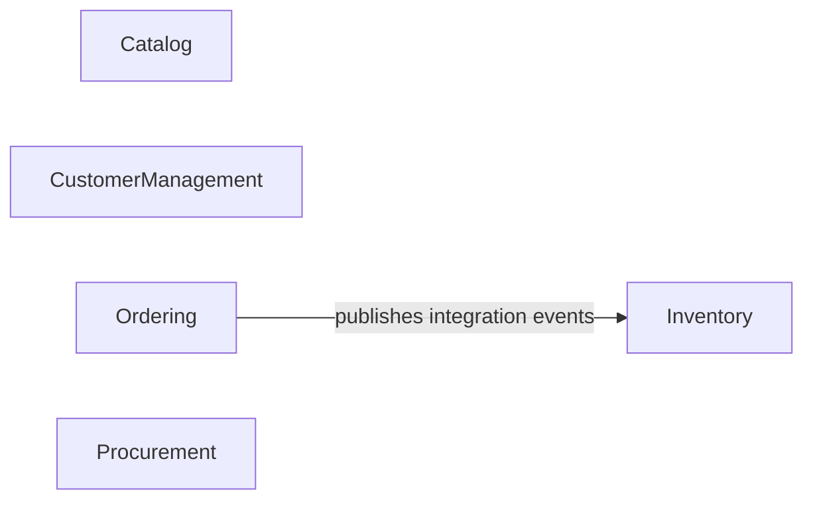

# Invoria


Invoria is a modular .NET 8 backend platform organized around business modules and clean architecture principles.  
The solution is designed for clear separation of concerns, scalable feature development, and cross-module integration through contracts and messaging.

## 🚧 Development Status

This project is currently **under active development**.  
Some modules and integrations are still evolving, and behavior or APIs may change as implementation progresses.

## ✨ Features

- **Modular architecture** with independent business modules and shared building blocks.
- **CQRS-oriented application layer** with request handlers and DTO-based contracts.
- **HTTP API layer** built with FastEndpoints and documented with Swagger/OpenAPI.
- **Persistence with EF Core** and module-specific DbContexts/migrations.
- **Integration messaging** using Rebus with SQL Server transport.
- **Cross-cutting infrastructure** for exception handling, validation, and result-to-HTTP mapping.

## 📦 Business Modules

- **Catalog**: product-related domain, commands, queries, endpoints, and contracts.
- **CustomerManagement**: customer-focused domain/application/endpoints stack.
- **Ordering**: order workflows and integration contracts/events for downstream modules.
- **Inventory**: batch management and integration event consumption from ordering flows.
- **Procurement**: procurement domain and APIs integrated into the host.

## 🏛️ Architecture

Invoria follows a **modular clean architecture** structure:

- **Host/API** (`Invoria.Api`): composition root, module installation, endpoint and middleware wiring.
- **BuildingBlocks** (`Invoria.BuildingBlocks.*`): shared abstractions for core, domain, application, EF, and infrastructure.
- **Modules** (`Invoria.<Module>.*`): each module is split into Domain, Application, Infrastructure, Endpoints, and Contracts.

### Layer Responsibilities

- **Domain**: aggregates/entities, business rules, domain abstractions.
- **Application**: use cases, CQRS commands/queries, handlers, factories.
- **Infrastructure**: EF Core persistence, service installers, external integration plumbing.
- **Endpoints**: HTTP transport concerns, validation, request/response orchestration.
- **Contracts**: DTOs and integration event contracts shared across boundaries.

### High-Level Interaction (Modules)

The diagram below focuses on **module-to-module interactions** and hides internal implementation details such as building blocks, EF, and wiring.



For lower-level architecture details (layers, building blocks, and Rebus wiring), see `ai/Architecture.md`.

## 🛠️ Tech Stack and Dependencies

- **Runtime**: .NET 8 (`net8.0`)
- **Web/API**: ASP.NET Core, FastEndpoints, FastEndpoints.Swagger
- **Application pattern**: CQRS + MediatR-style handler flow
- **Validation**: FluentValidation
- **Persistence**: Entity Framework Core + SQL Server/LocalDB
- **Messaging**: Rebus + SQL Server transport/subscriptions
- **Logging**: Serilog
- **Dependency injection/container**: Microsoft DI + Autofac integration

## ✅ Prerequisites

Install the following before running locally:

- .NET 8 SDK
- SQL Server LocalDB or SQL Server instance
- Git

## ⚙️ Configuration

Primary API config is in `src/Invoria.Api/appsettings.json`.

`appsettings.Development.json` is used to override values when `ASPNETCORE_ENVIRONMENT=Development`.

### AppSettings Key Reference

- `Logging:LogLevel:Default`
  - Controls baseline log verbosity for application logs.
  - Current value: `Information`.
  - Increase to `Debug` for deeper local diagnostics.

- `Logging:LogLevel:Microsoft.AspNetCore`
  - Overrides ASP.NET Core framework log level.
  - Current value: `Warning`.
  - Keeps framework noise lower while preserving your app logs.

- `ConnectionStrings:Default`
  - Main SQL Server/LocalDB connection used by EF Core and module persistence.
  - Current default points to LocalDB (`(localdb)\\MSSQLLocalDB`) with database `Invoria`.
  - If startup fails with DB errors, verify LocalDB/SQL Server is installed and reachable.

- `Rebus:InputQueue`
  - Queue name this service listens on for incoming integration messages.
  - Current value: `invoria`.
  - If messaging does not flow, ensure publishers/subscribers agree on queue naming and transport DB.

- `AllowedHosts`
  - ASP.NET Core host filtering setting for allowed `Host` headers.
  - Current value: `*` (allow all hosts), common for local development.

### Local Override Options

For local customization, prefer overrides instead of editing committed defaults:

- `appsettings.Development.json` for developer-machine values.
- Environment variables (for CI/CD and local shell overrides).
- User Secrets for sensitive local values (recommended for credentials).

Example environment variable for nested keys:

```bash
setx ConnectionStrings__Default "Server=.;Database=Invoria;Trusted_Connection=True;TrustServerCertificate=True"
```

### Common Troubleshooting

- **Database connection errors**: check `ConnectionStrings:Default`, SQL Server/LocalDB availability, and database permissions.
- **Unexpected log verbosity**: verify both `Logging:LogLevel:Default` and `Logging:LogLevel:Microsoft.AspNetCore`.
- **Message consumer not receiving events**: confirm `Rebus:InputQueue` and SQL transport/subscription configuration alignment.

## ▶️ Run Locally

From the repository root:

```bash
dotnet restore
dotnet build Invoria.sln
```

Run the API host:

```bash
dotnet run --project src/Invoria.Api/Invoria.Api.csproj
```

### Local Endpoints

Based on current launch settings:

- `http://localhost:5069`
- `https://localhost:7012`

Swagger UI is enabled in Development.

### Database and Startup Behavior

- The API is modular and installs module infrastructure at startup.
- Module bootstrappers may apply pending EF Core migrations during startup (depending on module implementation).
- Ensure `ConnectionStrings:Default` points to a reachable local database.

## 🧪 Testing

Run all tests:

```bash
dotnet test Invoria.sln
```

Run a module-specific test project example:

```bash
dotnet test tests/Modules/Inventory/Inventory.Application.Tests/Invoria.Inventory.Application.Tests.csproj
```

## 🗂️ Repository Structure

```text
Invoria/
|- src/
|  |- Invoria.Api/
|  |- BuildingBlocks/
|  `- Modules/
|     |- Catalog/
|     |- CustomerManagement/
|     |- Ordering/
|     |- Inventory/
|     `- Procurement/
|- tests/
|- ai/
`- Invoria.sln
```

## 🤝 Contributing

- Keep changes scoped and module-focused.
- Follow existing architecture boundaries (Domain/Application/Infrastructure/Endpoints/Contracts).
- Add or update tests for functional changes.
- Prefer clear, incremental pull requests while the project is evolving.