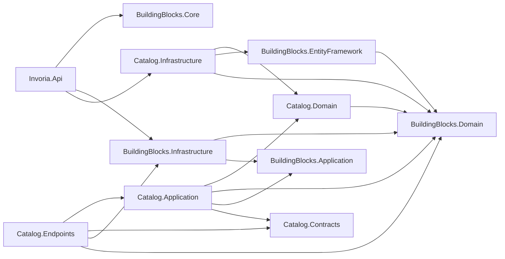

## Invoria Architecture

This document describes the current architecture of the Invoria solution based on the existing codebase. It follows a modular clean architecture style with clearly separated layers per module.

- **Host/API**: `Invoria.Api`
- **Shared building blocks**: `Invoria.BuildingBlocks.*`
- **Business module**: Catalog (`Invoria.Catalog.*`)
- **Tests**: `Invoria.*.Tests`, including Catalog-specific application and endpoint tests

The sections below list only modules, layers, classes, and relationships that exist in the repository.

---

## Solution Overview

### Projects and Responsibilities

- **Host / API**
  - `src/Invoria.Api/Invoria.Api.csproj`
  - ASP.NET Core host application.
  - Wires modules, shared infrastructure, FastEndpoints, Swagger, and global exception handling.

- **Building Blocks**
  - `Invoria.BuildingBlocks.Core`
    - Core primitives for modularity and extensions.
  - `Invoria.BuildingBlocks.Domain`
    - Base domain entities, aggregate roots, repository abstractions, results, and domain exceptions.
  - `Invoria.BuildingBlocks.Application`
    - CQRS abstractions for commands/queries and their handlers.
  - `Invoria.BuildingBlocks.EntityFramework`
    - EF Core base `DbContext`, generic repositories, and hook engine.
  - `Invoria.BuildingBlocks.Infrastructure`
    - HTTP endpoint base classes, result-to-HTTP mapping, and other web/infrastructure helpers.

- **Catalog Module**
  - Domain: `Invoria.Catalog.Domain`
  - Application: `Invoria.Catalog.Application`
  - Infrastructure: `Invoria.Catalog.Infrastructure`
  - Presentation / Endpoints: `Invoria.Catalog.Endpoints`
  - Contracts: `Invoria.Catalog.Contracts`

- **Tests**
  - `Invoria.Application.Tests`
  - `Invoria.Endpoints.Tests`
  - `Invoria.Catalog.Application.Tests`

### High-Level Module Dependencies



---

## Host Module (Invoria.Api)

### Responsibilities

- Bootstrap the application and configure shared infrastructure.
- Install functional modules (currently, Catalog).
- Configure FastEndpoints discovery and Swagger.
- Register global exception handling and problem details.

### Key Types

- **`ApiModuleInstaller`**
  - Location: `src/Invoria.Api/ApiModuleInstaller.cs`
  - Implements `IModuleInstaller` from building blocks.
  - Installs the Catalog module via `services.InstallModule<CatalogModuleInstaller>(configuration)`.
  - Adds shared application infrastructure via `AddApplicationInfrastructure()`.
  - Registers global exception handler `GlobalExceptionHandler` and `ProblemDetails`.
  - Configures Swagger using `SwaggerDocument`.
  - Configures FastEndpoints, using `EndpointsAssemblyRegistry.GetAssemblies()` to discover endpoint assemblies.

- **`GlobalExceptionHandler`**
  - Location: `src/Invoria.Api/Infrastructure/GlobalExceptionHandler.cs`
  - Integrates with ASP.NET Core exception handling.
  - Maps exceptions to standardized HTTP problem details responses.

---

## BuildingBlocks Module

The `Invoria.BuildingBlocks.*` projects provide shared abstractions and infrastructure used by all modules.

### Core (`Invoria.BuildingBlocks.Core`)

- **Purpose**
  - Provide modularity and extension helpers used for registering modules and application infrastructure.

- **Key Concepts**
  - **`IModuleInstaller`**
    - Interface implemented by `ApiModuleInstaller` and module installers (e.g., `CatalogModuleInstaller`) to encapsulate DI registrations.
  - **Extension methods**
    - Methods such as `InstallModule<TInstaller>` and `AddApplicationInfrastructure` used by the host to compose modules and shared infrastructure.

### Domain (`Invoria.BuildingBlocks.Domain`)

- **Purpose**
  - Provide base types and primitives for domain models shared across modules.

- **Key Classes / Interfaces**
  - **`AuditedAggregateRoot`**
    - Base class for aggregate roots that include auditing fields.
    - Extended by `Product` in the Catalog domain.
  - **`IBaseEntity`**
    - Marker/contract implemented by entities managed by repositories.
  - **`IRepository<T>`**
    - Generic repository abstraction; extended by module-specific repositories like `ICatalogRepository<T>`.
  - **`Result<T>`**
    - Operation result type representing success/failure with payload or errors.
    - Used as the return type from application command handlers.
  - **Domain exceptions (e.g., `NotFoundException`)**
    - Used by application layer to signal domain-related errors, later mapped to HTTP responses.

### Application (`Invoria.BuildingBlocks.Application`)

- **Purpose**
  - Encapsulate CQRS abstractions for commands, queries, and their handlers.

- **Key Interfaces**
  - **`ICommand<TResponse>`**
    - Represents a command that returns a response of type `TResponse`.
    - Implemented by `CreateProductCommand` and `UpdateProductCommand`.
  - **`IApplicatonRequestHandler<TCommand, TResponse>`**
    - Handler contract for processing commands/requests.
    - Implemented by `CreateProductCommandHandler` and `UpdateProductCommandHandler`.

### EntityFramework (`Invoria.BuildingBlocks.EntityFramework`)

- **Purpose**
  - Provide shared EF Core infrastructure and hooks.

- **Key Types**
  - **`InvoriaDbContext`**
    - Base `DbContext` used as the parent for module-specific contexts like `CatalogDbContext`.
  - **`EFCoreRepository<TEntity, TContext>`**
    - Generic EF Core repository implementation.
    - Extended by `CatalogRepository<TEntity>` for the Catalog module.
  - **`IDbHookEngine`**
    - Hook engine for cross-cutting behaviors during EF operations (e.g., auditing, domain events).
    - Injected into `CatalogDbContext`.

### Infrastructure (`Invoria.BuildingBlocks.Infrastructure`)

- **Purpose**
  - Shared HTTP and infrastructure utilities, especially for endpoint handling and result mapping.

- **Key Types**
  - **`EndpointBase<TRequest, TResponse>`**
    - Base class for FastEndpoints endpoints.
    - Extended by Catalog endpoints such as `CreateProductEndpoint` and `UpdateProductEndpoint`.
  - **`IResultToHttpMapper`**
    - Maps domain `Result<T>` values to HTTP responses.
    - Used by endpoint base class to produce standardized responses.
  - **Endpoint and DI extensions**
    - E.g., `EndpointsAssemblyRegistry.GetAssemblies()` to enumerate endpoint assemblies for FastEndpoints registration.

---

## Catalog Module

The Catalog module is structured into distinct layers following modular clean architecture.

```mermaid
flowchart LR
  catEndpoints[Catalog.Endpoints (Presentation)]
  catApp[Catalog.Application]
  catDomain[Catalog.Domain]
  catInfra[Catalog.Infrastructure]
  catContracts[Catalog.Contracts]

  catEndpoints --> catApp
  catEndpoints --> catContracts

  catApp --> catDomain
  catApp --> catContracts

  catInfra --> catDomain

  catDomain -->|"extends"| bbDomain[BuildingBlocks.Domain]
  catInfra -->|"uses"| bbEf[BuildingBlocks.EntityFramework]
```

### Domain Layer (`Invoria.Catalog.Domain`)

- **Location**
  - `src/Modules/Catalog/Catalog.Domain`

- **Main Classes / Interfaces**
  - **`Product`**
    - File: `Products/Product.cs`
    - Aggregate root representing a catalog product.
    - Inherits from `AuditedAggregateRoot`, gaining base identity and auditing fields.
    - Properties: `Name`, `Code` (optional), `Price`.
    - Behaviors:
      - Constructor enforces initialization of core fields.
      - `Update(string name, string? code, decimal price)` for modifying state consistently.
  - **`ProductTableConsts`**
    - File: `Products/Product.cs`
    - Static class with schema-related constants:
      - `TableName`, `IdMaxLength`, `NameMaxLength`, `CodeMaxLength`.
    - Used by validation and EF configuration to keep lengths consistent.
  - **`ICatalogRepository<T>`**
    - File: `ICatalogRepository.cs`
    - Module-specific repository abstraction.
    - Extends `IRepository<T>` from `Invoria.BuildingBlocks.Domain.Repositories`.
    - Constrained to `T : IBaseEntity`.

- **Relationships**
  - `Product` extends `AuditedAggregateRoot` (shared domain base type).
  - `ICatalogRepository<T>` refines the generic `IRepository<T>` for the Catalog domain.
  - `ProductTableConsts` is referenced by validators in the Endpoints layer and by EF configuration in Infrastructure, binding validation and persistence to shared constants.

### Application Layer (`Invoria.Catalog.Application`)

- **Location**
  - `src/Modules/Catalog/Catalog.Application`

- **Assembly Reference**
  - **`AssemblyReference`**
    - File: `AssemblyReference.cs`
    - Exposes `AssemblyReference.Assembly = Assembly.GetExecutingAssembly();`
    - Used for scanning and registration (e.g., CQRS handlers, validators).

- **Commands**
  - **`CreateProductCommand`**
    - File: `Products/Commands/CreateProduct/CreateProductCommand.cs`
    - Implements `ICommand<ProductDto>`.
    - Properties: `Name`, `Code`, `Price`.
    - Represents the intention to create a new product.
  - **`UpdateProductCommand`**
    - File: `Products/Commands/UpdateProduct/UpdateProductCommand.cs`
    - Implements `ICommand<ProductDto>`.
    - Properties: `Id`, `Name`, `Code`, `Price`.
    - Represents the intention to update an existing product.

- **Command Handlers**
  - **`CreateProductCommandHandler`**
    - File: `Products/Commands/CreateProduct/CreateProductCommandHandler.cs`
    - Implements `IApplicatonRequestHandler<CreateProductCommand, ProductDto>`.
    - Dependencies:
      - `ICatalogRepository<Product>` (domain repository abstraction).
      - `IProductResponseFactory` (application-layer factory for DTO mapping).
    - Behavior:
      - Creates a new `Product` from the command.
      - Persists it via `_productRepository.Add(product)`.
      - Uses `_productResponseFactory.PrepareDto(product)` to produce a `ProductDto`.
      - Returns `Result<ProductDto>` wrapping the DTO.
  - **`UpdateProductCommandHandler`**
    - File: `Products/Commands/UpdateProduct/UpdateProductCommandHandler.cs`
    - Implements `IApplicatonRequestHandler<UpdateProductCommand, ProductDto>`.
    - Dependencies:
      - `ICatalogRepository<Product>`.
      - `IProductResponseFactory`.
    - Behavior:
      - Loads a `Product` via `_productRepository.SingleOrDefault(p => p.Id == request.Id, cancellationToken)`.
      - If not found, returns `Result.Failure<ProductDto>(new NotFoundException(...))`.
      - Calls `product.Update(...)` to change state.
      - Persists changes via `_productRepository.Update(product, cancellationToken)`.
      - Maps to `ProductDto` using `IProductResponseFactory`.

- **Factories**
  - **`IProductResponseFactory` / `ProductResposneFactory`**
    - Files: `Products/Factories/IProductResponseFactory.cs`, `ProductResposneFactory.cs`
    - Responsible for converting `Product` entities into `ProductDto` instances.
    - Encapsulate mapping logic so that handlers remain focused on use cases.

- **Relationships**
  - Commands (`CreateProductCommand`, `UpdateProductCommand`) depend only on DTOs (`ProductDto`) and are part of the application layer.
  - Handlers depend on:
    - Domain abstractions (`ICatalogRepository<Product>`, `Product`).
    - Shared domain primitives (`Result<T>`, `NotFoundException`).
    - Application-specific mapping services (`IProductResponseFactory`).
  - No direct dependency from Application to Infrastructure; repositories are injected via abstractions.

### Infrastructure Layer (`Invoria.Catalog.Infrastructure`)

- **Location**
  - `src/Modules/Catalog/Catalog.Infrastructure`

- **DbContext**
  - **`CatalogDbContext`**
    - File: `EntityFramework/CatalogDbContext.cs`
    - Inherits from `InvoriaDbContext` (from building blocks).
    - Constructor accepts `DbContextOptions` and `IDbHookEngine`.
    - Overrides `OnModelCreating`:
      - Calls `modelBuilder.ApplyConfigurationsFromAssembly(Assembly.GetExecutingAssembly());` to apply all entity configurations in the assembly.
      - Invokes base `OnModelCreating`.

- **Repositories**
  - **`CatalogRepository<TEntity>`**
    - File: `EntityFramework/Repositories/CatalogRepository.cs`
    - Extends `EFCoreRepository<TEntity, CatalogDbContext>`.
    - Implements `ICatalogRepository<TEntity>` from the Domain layer.
    - Constrained to `TEntity : class, IBaseEntity`.
    - Bridges the domain repository abstraction with EF Core persistence.

- **Entity Configuration and Migrations**
  - **`ProductEntityTypeConfiguration`**
    - File: `EntityFramework/Configuration/ProductEntityTypeConfiguration.cs`
    - Configures EF Core mapping for `Product`:
      - Table name and property configurations based on `ProductTableConsts`.
  - **Migrations**
    - Files under `EntityFramework/Migrations`, e.g.:
      - `20260315004635_ProductMigration.cs`
      - `20260315004635_ProductMigration.Designer.cs`
      - `CatalogDbContextModelSnapshot.cs`
    - Represent the current schema state for the Catalog module.

- **Module Bootstrapping**
  - **`CatalogModuleBootStrapper` / `CatalogModuleInstaller`**
    - Files: `CatalogModuleBootStrapper.cs`, `CatalogModuleInstaller.cs`
    - Register:
      - `CatalogDbContext` with the DI container.
      - `ICatalogRepository<>` implementation (`CatalogRepository<>`).
      - EF installers (`EntityFrameworkServiceInstaller`) and application/endpoint installers.
    - `CatalogModuleInstaller` is invoked by `ApiModuleInstaller` via `services.InstallModule<CatalogModuleInstaller>(configuration)`.

- **Relationships**
  - Infrastructure depends on:
    - Catalog Domain (`Product`, `ICatalogRepository<T>`, `ProductTableConsts`, `IBaseEntity`).
    - BuildingBlocks EntityFramework (`InvoriaDbContext`, `EFCoreRepository<,>`, `IDbHookEngine`).
    - BuildingBlocks Domain (`IBaseEntity`).
  - Provides concrete persistence for application use cases while staying behind abstractions.

### Presentation Layer (`Invoria.Catalog.Endpoints`)

- **Location**
  - `src/Modules/Catalog/Catalog.Endpoints`

- **Routing**
  - **`ProductRoutingGroup`**
    - File: `Products/ProductRoutingGroup.cs`
    - Inherits from `Group` (FastEndpoints).
    - Configures base route path `"products"`.
    - Adds OpenAPI documentation details:
      - Tag `"Products"`.
      - Standard error response types (401, 403, 404, 500) with `ProblemDetails`.

- **Endpoints**
  - **`CreateProductEndpoint`**
    - File: `Products/CreateProductEndpoint.cs`
    - Inherits `EndpointBase<CreateProductRequest, ProductDto>`.
    - Dependencies:
      - `IResultToHttpMapper` (from building blocks).
      - `IMediator` (MediatR).
    - `Configure`:
      - Registers HTTP `POST ""` under the `products` group.
      - Marks endpoint as `AllowAnonymous()`.
    - `HandleAsync`:
      - Resolves `IValidator<CreateProductRequest>` via `Resolve<IValidator<CreateProductRequest>>()`.
      - Validates the request, returning early if invalid.
      - Constructs a `CreateProductCommand` from request data.
      - Sends the command via `_mediator.Send(command)`.
      - Uses `SendResultAsync(result)` to map `Result<ProductDto>` to HTTP response.
  - **`UpdateProductEndpoint`**
    - File: `Products/UpdateProductEndpoint.cs`
    - Inherits `EndpointBase<UpdateProductRequest, ProductDto>`.
    - Dependencies:
      - `IResultToHttpMapper`.
      - `IMediator`.
    - `Configure`:
      - Registers HTTP `PUT "{id}"` under the `products` group.
      - Marks endpoint as `AllowAnonymous()`.
    - `HandleAsync`:
      - Resolves `IValidator<UpdateProductRequest>`.
      - Validates the request.
      - Constructs an `UpdateProductCommand` including the `Id` from the route/body.
      - Sends the command via `_mediator.Send(command, ct)`.
      - Uses `SendResultAsync(result)` to return a mapped HTTP response.

- **Requests and Validation**
  - **`ProductRequest`**
    - File: `Products/Requests/ProductRequest.cs`
    - Base request type with properties: `Name`, `Code`, `Price`.
  - **`ProductRequestValidator<T>`**
    - File: `Products/Requests/ProductRequest.cs`
    - Generic validator class where `T : ProductRequest`.
    - Uses FluentValidation.
    - Rules:
      - `Name`: required, length between 3 and `ProductTableConsts.NameMaxLength`.
      - `Code`: optional, when not null length between 3 and `ProductTableConsts.CodeMaxLength`.
      - `Price`: must be greater than 0.
    - Example of a cross-layer reference:
      - Uses `ProductTableConsts` from the Domain layer to ensure validation aligns with persistence constraints.
  - **`CreateProductRequest`**
    - File: `Products/Requests/CreateProductRequest.cs`
    - Inherits from `ProductRequest`.
    - Paired with `CreateProductRequestValidator : ProductRequestValidator<CreateProductRequest>`.
  - **`UpdateProductRequest`**
    - File: `Products/Requests/UpdateProductRequest.cs`
    - Inherits from `ProductRequest`.
    - Adds `Id` property (string).
    - Paired with `UpdateProductRequestValidator : ProductRequestValidator<UpdateProductRequest>`.

- **Relationships**
  - Endpoints construct commands (`CreateProductCommand`, `UpdateProductCommand`) from request models.
  - Validators reuse domain constants (`ProductTableConsts`), tying validation rules to the domain schema.
  - Endpoints depend on application handlers indirectly via MediatR.
  - Responses are always `ProductDto`, ensuring a consistent contract between application and presentation.

### Contracts Layer (`Invoria.Catalog.Contracts`)

- **Location**
  - `src/Modules/Catalog/Catalog.Contracts`

- **DTOs**
  - **`ProductDto`**
    - File: `Dtos/ProductDto.cs`
    - Inherits from `AuditedEntityDto` (from building blocks).
    - Properties: `Name`, `Code`, `Price`.
    - Used as:
      - The response type for commands (`ICommand<ProductDto>`).
      - The response type for endpoints (`EndpointBase<..., ProductDto>`).

- **Relationships**
  - `ProductDto` serves as the transport representation of `Product` from the domain.
  - Mapping between `Product` and `ProductDto` is implemented in `IProductResponseFactory` / `ProductResposneFactory` in the Application layer.

---

## Cross-Cutting Concerns

### Validation

- **Library**
  - FluentValidation is used for request validation.

- **Pattern**
  - Generic validator `ProductRequestValidator<T>` encapsulates shared rules based on domain constants (`ProductTableConsts`).
  - Specific validators (`CreateProductRequestValidator`, `UpdateProductRequestValidator`) inherit from the generic validator.
  - Endpoints resolve validators via FastEndpoints’ `Resolve<IValidator<T>>()` and execute validation in `HandleAsync` before sending commands.

### Error Handling and Problem Details

- **Global Exception Handling**
  - `ApiModuleInstaller` registers `GlobalExceptionHandler` and `ProblemDetails` support:
    - `services.AddExceptionHandler<GlobalExceptionHandler>();`
    - `services.AddProblemDetails();`
  - `GlobalExceptionHandler` maps thrown exceptions to `ProblemDetails` responses.

- **Result-Based Errors**
  - Application handlers return `Result<T>` (`Result<ProductDto>` for product commands).
  - Failures are expressed via `Result.Failure<T>` with domain exceptions like `NotFoundException`.
  - Endpoints use `IResultToHttpMapper` (inherited from `EndpointBase<,>`) to translate `Result<T>` into appropriate HTTP status codes and bodies.

### EF Hooks and Auditing

- **Auditing**
  - Domain entities like `Product` inherit from `AuditedAggregateRoot`, which provides audit fields.

- **Hooks**
  - `CatalogDbContext` takes an `IDbHookEngine` instance.
  - Hooks can apply cross-cutting behaviors during EF operations (e.g., audit population, domain event dispatch).

### CQRS and MediatR

- **Commands and Handlers**
  - The Application layer defines commands implementing `ICommand<TResponse>` and handlers implementing `IApplicatonRequestHandler<TCommand, TResponse>`.

- **Mediator**
  - Endpoints use `IMediator` to send commands (`_mediator.Send(command, ct)`), decoupling HTTP transport from application logic.

### Logging and Caching

- No explicit logging or caching abstractions are used in the Catalog-focused files inspected.
- Any logging or caching behavior would be implemented through:
  - ASP.NET Core logging infrastructure.
  - Additional building-blocks or MediatR behaviors not directly referenced in the Catalog slice.

---

## Summary of Layered Dependencies

- **Host (`Invoria.Api`)**
  - Orchestrates module installation and shared infrastructure.
  - Depends on:
    - BuildingBlocks Core and Infrastructure for modularity and endpoint wiring.
    - Catalog Infrastructure via `CatalogModuleInstaller`.

- **Catalog.Endpoints (Presentation)**
  - Only interacts with the **Application** layer and shared infrastructure:
    - Uses commands and DTOs from Application/Contracts.
    - Invokes handlers indirectly via MediatR.
    - Uses FluentValidation and result-to-HTTP mapping.

- **Catalog.Application**
  - Depends on:
    - **Domain** (entities, repository abstractions).
    - **Contracts** (DTOs).
    - BuildingBlocks Domain and Application (results, exceptions, CQRS interfaces).

- **Catalog.Domain**
  - Depends only on BuildingBlocks Domain for base entities and repository abstractions.

- **Catalog.Infrastructure**
  - Depends on:
    - **Domain** (entities and repository interfaces).
    - BuildingBlocks EntityFramework (DbContext base, repositories, hooks).
    - BuildingBlocks Domain for `IBaseEntity`.

This structure ensures a clear separation of concerns: endpoints handle HTTP and validation, the application layer orchestrates use cases, the domain encapsulates core business rules and entities, and infrastructure provides persistence and integration details behind domain abstractions.

