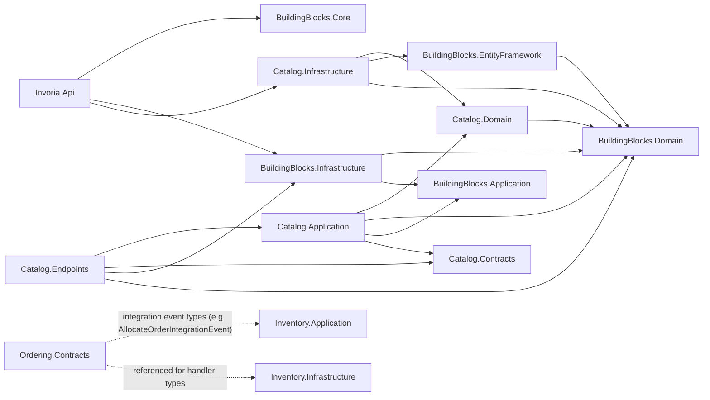
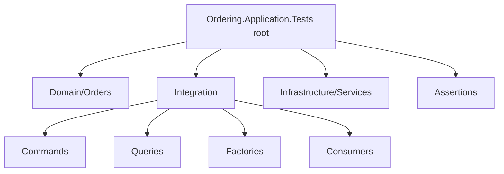
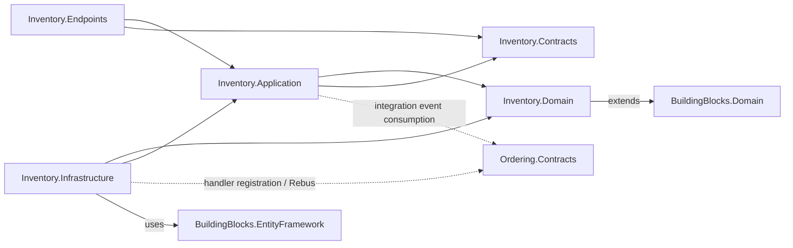
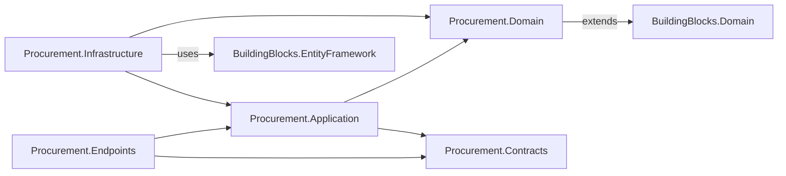

## Invoria Architecture

This document describes the current architecture of the Invoria solution based on the existing codebase. It follows a modular clean architecture style with clearly separated layers per module.

- **Host/API**: `Invoria.Api`
- **Shared building blocks**: `Invoria.BuildingBlocks.*`
- **Business module**: Catalog (`Invoria.Catalog.*`)
- **Business module**: CustomerManagement (`Invoria.CustomerManagement.*`)
- **Business module**: Ordering (`Invoria.Ordering.*`)
- **Business module**: Procurement (`Invoria.Procurement.*`) — suppliers, purchase orders, and CQRS
- **Business module**: Inventory (`Invoria.Inventory.*`) — batches and CQRS; consumes Ordering integration events via Rebus
- **Business module**: Reporting (`Invoria.Reporting.*`) — read models for reported orders and scheduled rollups
- **Tests**: `Invoria.*.Tests`, including Catalog-, Inventory-, Ordering-, Procurement-, and Reporting-focused application and endpoint tests where present

The sections below list only modules, layers, classes, and relationships that exist in the repository.

---

## Solution Overview

### Projects and Responsibilities

- **Host / API**
  - `src/Invoria.Api/Invoria.Api.csproj`
  - ASP.NET Core host application.
  - Wires modules, shared infrastructure, FastEndpoints, Swagger, and global exception handling.

- **Building Blocks**
  - `Invoria.BuildingBlocks.Core`
    - Core primitives for modularity and extensions.
  - `Invoria.BuildingBlocks.Domain`
    - Base domain entities, aggregate roots, repository abstractions, results, and domain exceptions.
  - `Invoria.BuildingBlocks.Application`
    - CQRS abstractions for commands/queries and their handlers.
  - `Invoria.BuildingBlocks.EntityFramework`
    - EF Core base `DbContext`, generic repositories, and hook engine.
  - `Invoria.BuildingBlocks.Infrastructure`
    - HTTP endpoint base classes, result-to-HTTP mapping, and other web/infrastructure helpers.

- **Catalog Module**
  - Domain: `Invoria.Catalog.Domain`
  - Application: `Invoria.Catalog.Application`
  - Infrastructure: `Invoria.Catalog.Infrastructure`
  - Presentation / Endpoints: `Invoria.Catalog.Endpoints`
  - Contracts: `Invoria.Catalog.Contracts`

- **CustomerManagement Module**
  - Domain: `Invoria.CustomerManagement.Domain`
  - Application: `Invoria.CustomerManagement.Application`
  - Infrastructure: `Invoria.CustomerManagement.Infrastructure`
  - Presentation / Endpoints: `Invoria.CustomerManagement.Endpoints`
  - Contracts: `Invoria.CustomerManagement.Contracts`

- **Ordering Module**
  - Domain: `Invoria.Ordering.Domain`
  - Application: `Invoria.Ordering.Application`
  - Infrastructure: `Invoria.Ordering.Infrastructure`
  - Presentation / Endpoints: `Invoria.Ordering.Endpoints`
  - Contracts: `Invoria.Ordering.Contracts` (order integration events); `Invoria.Inventory.Contracts` (allocation integration events such as `AllocateOrderIntegrationEvent`)

- **Inventory Module**
  - Domain: `Invoria.Inventory.Domain`
  - Application: `Invoria.Inventory.Application`
  - Infrastructure: `Invoria.Inventory.Infrastructure`
  - Presentation / Endpoints: `Invoria.Inventory.Endpoints`
  - Contracts: `Invoria.Inventory.Contracts`
  - Current scope: batch aggregate and endpoints; Rebus handler registration and optional integration consumer types for cross-module events

- **Procurement Module**
  - Domain: `Invoria.Procurement.Domain`
  - Application: `Invoria.Procurement.Application`
  - Infrastructure: `Invoria.Procurement.Infrastructure`
  - Presentation / Endpoints: `Invoria.Procurement.Endpoints`
  - Contracts: `Invoria.Procurement.Contracts`

- **Reporting Module**
  - Domain: `Invoria.Reporting.Domain`
  - Application: `Invoria.Reporting.Application`
  - Infrastructure: `Invoria.Reporting.Infrastructure`
  - Presentation / Endpoints: `Invoria.Reporting.Endpoints`
  - Contracts: `Invoria.Reporting.Contracts`
  - **Materialized rollups**: `ReportedOrderStatusByDay`, `OrderPeriodSummary` (Day/Week/Month by `Granularity`; placed-date rollups store `DateField = 0` for compatibility with the composite key), and `DebtSummary` (global + per-customer from completed orders with outstanding balance) are rebuilt on a shared ~5 minute hosted refresh loop from `ReportedOrder`. The `ListOrderPeriodSummary` endpoint exposes a paged read of `OrderPeriodSummary` with optional `From`/`To` (default: last 30 UTC days ending today when both omitted), default `GroupedBy` Day, default paging `Skip`/`Length`, and newest period first within the resolved range. Order status aggregates are exposed via `GetOrderStatusSummary`. Debt overview reads use `GetDebtOverview` (single global snapshot), paged `ListCustomerDebtOverview` (per-customer rows ordered by highest outstanding first), and `GetCustomerDebtSummary` (single customer by id).

- **Tests**
  - `Invoria.Application.Tests`
  - `Invoria.Endpoints.Tests`
  - `Invoria.Catalog.Application.Tests`
  - `Invoria.Inventory.Application.Tests`, `Invoria.Inventory.Endpoints.Tests` (where present)
  - `Invoria.Ordering.Application.Tests`, `Invoria.Ordering.Endpoints.Tests` (where present)
  - `Invoria.Procurement.Application.Tests`, `Invoria.Procurement.Endpoints.Tests` (where present)
  - `Invoria.Reporting.Application.Tests`, `Invoria.Reporting.Domain.Tests`, `Invoria.Reporting.Endpoints.Tests` (where present)

### High-Level Module Dependencies



Other business modules (CustomerManagement, Ordering, Procurement, Inventory, and Reporting) follow the same layered layout as Catalog: Domain, Application, Infrastructure, Endpoints, and Contracts. The diagram above highlights Catalog and the Ordering-to-Inventory integration contract edge; see module-specific sections below for representative types and paths.

---

## Ordering Module (integration contracts)

### Contracts (`Invoria.Ordering.Contracts`)

- **Location**
  - `src/Modules/Ordering/Ordering.Contracts`

- **Layout** (bounded context `Orders/`; namespaces follow folders—see `.cursor/rules/module-contracts.mdc`)
  - `Orders/Enums/` — `OrderStatus`, `OrderPaymentType`, `AllocationReleaseReason`, etc. (`Invoria.Ordering.Contracts.Orders.Enums`)
  - `Orders/Dtos/` — `OrderDto`, `OrderItemDto`, … (`Invoria.Ordering.Contracts.Orders.Dtos`)
  - `Orders/Events/` — integration events (`Invoria.Ordering.Contracts.Orders.Events`)
  - `Orders/Models/` — `OrderModel`, `OrderItemModel`, `OrderLineModel` (`Invoria.Ordering.Contracts.Orders.Models`)

- **Integration events**
  - **`OrderCreatedIntegrationEvent`**
    - File: `Orders/Events/OrderCreatedIntegrationEvent.cs`
    - Raised from domain event **`OrderCreatedDomainEvent`** (`Ordering.Domain/Orders/Events/`) when `Order.Create` runs; carries the full **`Order`** aggregate. **`OrderCreatedDomainEventHandler`** maps it to `OrderModel` and publishes the integration event.
  - **`OrderAcceptedIntegrationEvent`**
    - File: `Orders/Events/OrderAcceptedIntegrationEvent.cs`
    - Published when an order is accepted (Processing); consumed by **`OrderSaga`** to trigger inventory allocation.

- **Relationships**
  - `Ordering.Contracts` may reference other modules’ contract projects for shared DTO shapes (as configured in `Invoria.Ordering.Contracts.csproj`).

### Tests (`Invoria.Ordering.Application.Tests`)

- **Location**
  - `tests/Modules/Ordering/Ordering.Application.Tests`

- **Layout**
  - **Root**: shared test harness — `OrderingTestFixture.cs`, `OrderingTestModuleInstaller.cs`, `GlobalUsings.cs`.
  - **`Domain/Orders/`**: pure domain tests (e.g. `OrderAllocationSuccessDomainTests`, `OrderAllocationFailureDomainTests`).
  - **`Integration/`**: handler and integration tests — `Commands/`, `Queries/`, `Factories/`, `Consumers/` (e.g. allocation consumer), plus `OrderTestFixture.cs`.
  - **`Infrastructure/Services/`**: infrastructure-focused tests (e.g. `OrderNumberGeneratorTests`, `OrderNumberGeneratorIntegrationTests`).
  - **`Assertions/`**: shared assertion helpers (e.g. `OrderAssertionExtensions.cs`).



---

## Inventory Module

The Inventory module follows the same layered layout as Catalog: Domain, Application, Infrastructure, Endpoints, and Contracts.



### Domain (`Invoria.Inventory.Domain`)

- **Location**
  - `src/Modules/Inventory/Inventory.Domain`

- **Representative types**
  - **`Batch`** (and related value types such as batch state), used by batch commands and queries in the Application layer. **`AddReturn`** increases available **`Quantity`** via **`UpdateQuantity`** when returned stock is processed.
  - **`Allocation`**: aggregate for an order allocation request (`Pending` → `Allocated` → `Released`), with child **`AllocationLine`** rows per order item.
  - **`BatchAllocation`**: links an `AllocationLine` to a `BatchId`, records `QuantityAllocated` and `AllocatedAt`.
  - **`IAllocationDomainService`** / **`AllocationDomainService`**: domain service for FIFO stock reservation and release across allocation lines and batches.
  - **`AllocationInitiatedDomainEvent`**: raised from `Allocation.CreateForOrder` when the allocation aggregate is first created (`Allocations/Events/AllocationInitiatedDomainEvent.cs`).
  - **`AllocationCompletedDomainEvent`**: raised when every line is fully allocated (`Allocations/Events/AllocationCompletedDomainEvent.cs`).
  - **`AllocationFailedDomainEvent`**: raised when the allocation cannot be fully satisfied (`Allocations/Events/AllocationFailedDomainEvent.cs`).
  - **`Return`** (`Returns/Return.cs`): abstract aggregate root for order returns; properties `Type` (`ReturnType` discriminator), `Status` (`Invoria.Inventory.Contracts.Returns.Enums.ReturnStatus`, defaults to `Pending`), and `ReturnLines`. Lifecycle: `Approve()` (`Pending` → `Approved`, raises **`ReturnApprovedDomainEvent`**), `Reject()` (`Pending` → `Rejected`), `Complete()` (`Approved` → `Completed`). Concrete subclasses expose factory methods and set `Type` for EF TPH.
  - **`ReturnType`** (`Returns/ReturnType.cs`): domain discriminator enum (`Immediate`); values align with `Invoria.Inventory.Contracts.Returns.Enums.ReturnType`.
  - **`ReturnLine`** (`Returns/ReturnLine.cs`): child entity on `Return` with `ReturnId`, `OrderItemId`, `ProductId`, and `Quantity`.
  - **`ImmediateReturn`** (`Returns/ImmediateReturn.cs`): concrete `Return` with `ReturnType.Immediate`; requires `AllocationId`, `OrderId` (immediate-return only), and `ReturnLines` via `Create`; raises **`ImmediateReturnCreatedDomainEvent`** on create.
  - **`ImmediateReturnCreatedDomainEvent`** (`Returns/Events/ImmediateReturnCreatedDomainEvent.cs`): raised from `ImmediateReturn.Create` when a new immediate return is created.
  - **`ReturnApprovedDomainEvent`** (`Returns/Events/ReturnApprovedDomainEvent.cs`): raised from `Return.Approve` when a return transitions to `Approved`; carries the approved `Return` aggregate.
  - **`IReturnDomainService`** / **`ReturnDomainService`** (`Returns/Services/`): domain service for cross-aggregate immediate-return processing; **`ProcessImmediateReturn`** restores stock via **`Batch.AddReturn`** (by `BatchAllocation.BatchId` descending), then calls **`Return.Complete()`**.

### Application (`Invoria.Inventory.Application`)

- **Location**
  - `src/Modules/Inventory/Inventory.Application`

- **Integration consumers (Rebus)**
  - **`AllocateOrderIntegrationEventConsumer`**
    - File: `Batches/Consumers/AllocateOrderIntegrationEventConsumer.cs`
    - Handles `AllocateOrderIntegrationEvent` from Ordering; sends `AllocateOrderCommand` to create an `Allocation` aggregate.
  - **`RequestAllocationIntegrationEventConsumer`**
    - File: `Allocations/Consumers/RequestAllocationIntegrationEventConsumer.cs`
    - Handles `RequestAllocationIntegrationEvent`; sends `RequestAllocationCommand` to reserve stock from batches (FIFO) and mark the allocation as `Allocated`.
  - **`CreateImmediateReturnIntegrationEventConsumer`**
    - File: `Returns/Consumers/CreateImmediateReturnIntegrationEventConsumer.cs`
    - Handles `CreateImmediateReturnIntegrationEvent`; sends `CreateImmediateReturnCommand` to create an `ImmediateReturn` aggregate.
  - **`ProcessImmediateReturnIntegrationEventConsumer`**
    - File: `Returns/Consumers/ProcessImmediateReturnIntegrationEventConsumer.cs`
    - Handles `ProcessImmediateReturnIntegrationEvent`; sends `ProcessImmediateReturnCommand` (`ReturnId`).
  - **`ProcessImmediateReturnCommandHandler`**
    - File: `Returns/Commands/ProcessImmediateReturn/ProcessImmediateReturnCommandHandler.cs`
    - Handles `ProcessImmediateReturnCommand`; loads `ImmediateReturn`, `Allocation`, and batches, delegates to **`IReturnDomainService.ProcessImmediateReturn`**, persists via **`IInventoryUnitOfWork`**.

- **Domain event handlers**
  - **`AllocationInitiatedDomainEventHandler`**
    - File: `Allocations/Handlers/AllocationInitiatedDomainEventHandler.cs`
    - Handles `AllocationInitiatedDomainEvent` after save and publishes `RequestAllocationIntegrationEvent`.
  - **`AllocationCompletedDomainEventHandler`**
    - File: `Allocations/Handlers/AllocationCompletedDomainEventHandler.cs`
    - Handles `AllocationCompletedDomainEvent` after save and publishes `AllocationSucceededIntegrationEvent`.
  - **`AllocationFailedDomainEventHandler`**
    - File: `Allocations/Handlers/AllocationFailedDomainEventHandler.cs`
    - Handles `AllocationFailedDomainEvent` after save and publishes `AllocationFailedIntegrationEvent`.
  - **`ImmediateReturnCreatedDomainEventHandler`**
    - File: `Returns/Handlers/ImmediateReturnCreatedDomainEventHandler.cs`
    - Handles `ImmediateReturnCreatedDomainEvent` after save and publishes `ImmediateReturnCreatedIntegrationEvent`.
  - **`ReturnApprovedDomainEventHandler`**
    - File: `Returns/Handlers/ReturnApprovedDomainEventHandler.cs`
    - Handles `ReturnApprovedDomainEvent` after save; for `ReturnType.Immediate`, publishes `ProcessImmediateReturnIntegrationEvent` (`ReturnId`).

- **Immediate return flow**
  1. An external module publishes **`CreateImmediateReturnIntegrationEvent`** (`OrderId`, `AllocationId`, `Lines`); Inventory consumes it via **`CreateImmediateReturnIntegrationEventConsumer`** and sends **`CreateImmediateReturnCommand`**.
  2. **`CreateImmediateReturnCommandHandler`** — `Returns/Commands/CreateImmediateReturn/`; creates `ImmediateReturn` (`Pending`) from `OrderId`, `AllocationId`, and line items.
  3. `ImmediateReturnCreatedDomainEvent` is dispatched after save.
  4. **`ImmediateReturnCreatedDomainEventHandler`** publishes `ImmediateReturnCreatedIntegrationEvent` (`ReturnId`, `OrderId`, `AllocationId`).

- **Return approval flow**
  1. **`ApproveReturnCommandHandler`** — `Returns/Commands/ApproveReturn/`; approves a pending return via `Return.Approve()`.
  2. `ReturnApprovedDomainEvent` is dispatched after save.
  3. **`ReturnApprovedDomainEventHandler`** publishes `ProcessImmediateReturnIntegrationEvent` (`ReturnId`) when the approved return type is `Immediate`.
  4. **`ProcessImmediateReturnIntegrationEventConsumer`** sends **`ProcessImmediateReturnCommand`** (`ReturnId`).
  5. **`ProcessImmediateReturnCommandHandler`** loads aggregates and batches, runs **`IReturnDomainService.ProcessImmediateReturn`**, and persists the completed return with restored batch stock.

- **Order allocation flow**
  1. Ordering publishes `OrderAcceptedIntegrationEvent` when an order is accepted; **`OrderSaga`** transitions to `Allocating` and publishes `AllocateOrderIntegrationEvent` (contract in `Invoria.Inventory.Contracts.Allocations.Events`).
  2. Inventory creates `Allocation` (`Pending`) via `AllocateOrderCommand`.
  3. `AllocationInitiatedDomainEvent` is dispatched after save.
  4. `AllocationInitiatedDomainEventHandler` publishes `RequestAllocationIntegrationEvent`.
  5. `RequestAllocationIntegrationEventConsumer` runs `RequestAllocationCommand`; **`RequestAllocationCommandHandler`** loads the allocation (lines and batch allocations via EF `AutoInclude`), loads active batches for pending lines (FIFO by `CreatedAt` ascending), delegates reservation to **`IAllocationDomainService`** / **`AllocationDomainService`** (pending-line filtering and FIFO consumption), and persists inside a single transaction via **`IInventoryUnitOfWork`**.
  6. On success, `AllocationCompletedDomainEvent` is dispatched after save; **`AllocationCompletedDomainEventHandler`** publishes `AllocationSucceededIntegrationEvent` (`AllocationId`, `OrderId`).
  7. On failure, `AllocationFailedDomainEvent` is dispatched after save; **`AllocationFailedDomainEventHandler`** publishes `AllocationFailedIntegrationEvent` (`AllocationId`, `OrderId`).

- **Request allocation**
  - **`RequestAllocationCommand`** / **`RequestAllocationCommandHandler`** — `Allocations/Commands/RequestAllocation/`; loads allocation and batches, invokes the domain service, persists via **`IInventoryUnitOfWork`** (no allocation algorithm in the handler).
  - **`IAllocationDomainService`** / **`AllocationDomainService`** — `Allocations/Services/` in Domain; **`Allocate`** (FIFO reservation and failure rollback) and **`Release`** (restore reserved stock and mark allocation released) across `Allocation` and `Batch` aggregates (implements **`IDomainService`** from BuildingBlocks).
  - **`DomainServiceInstaller`** — `Infrastructure/Installers/`; registers domain services (e.g. **`IAllocationDomainService`**, **`IReturnDomainService`**).
  - **`IInventoryUnitOfWork`** / **`InventoryUnitOfWork`** — module unit-of-work port (`Inventory.Domain`) backed by **`EfUnitOfWork<InventoryDbContext>`**; registered from `EntityFrameworkServiceInstaller` with `AddInvoriaUnitOfWork`.

- **Release allocation**
  - **`ReleaseAllocationCommand`** / **`ReleaseAllocationCommandHandler`** — `Allocations/Commands/ReleaseAllocation/`; loads allocation and referenced batches, delegates to **`IAllocationDomainService.Release`**, persists via **`IInventoryUnitOfWork`**.

- **Fulfillment**
  - **`Fulfillment`** aggregate (`Pending` → `InProgress` → `Completed`); created from an **`Allocated`** allocation.
  - **`IFulfillmentDomainService`** / **`FulfillmentDomainService`** — `Fulfillments/Services/` in Domain; **`CreateFulfillment`** and **`Dispatch`** (commit reserved batch stock, complete fulfillment).
  - **`CreateFulfillmentCommand`** — direct MediatR command; creates fulfillment from allocation.
  - **`RequestDispatchFulfillmentCommand`** — direct MediatR command; moves fulfillment to **`InProgress`**; **`RequestDispatchDomainEventHandler`** publishes **`DispatchFulfillmentIntegrationEvent`**.
  - **`DispatchFulfillmentCommand`** — system command only (no HTTP endpoint); **`DispatchFulfillmentIntegrationEventConsumer`** handles **`DispatchFulfillmentIntegrationEvent`**; handler loads fulfillment, allocation, and batches, delegates to **`IFulfillmentDomainService.Dispatch`**; **`FulfillmentCompletedDomainEventHandler`** publishes **`FulfillmentCompletedIntegrationEvent`**.
  - **`Batch.DispatchReservedQuantity`** — commits reserved stock on dispatch (inverse of **`RestoreAllocatedQuantity`**; does not restore available quantity).

- **CQRS**
  - Batch commands, queries, and factories follow the same MediatR / handler patterns as other modules (see batch-related folders under `Batches/`).

### Infrastructure (`Invoria.Inventory.Infrastructure`)

- **Location**
  - `src/Modules/Inventory/Inventory.Infrastructure`

- **Rebus**
  - **`RebusHandlersServiceInstaller`**
    - File: `Installers/RebusHandlersServiceInstaller.cs`
    - Implements `IServiceInstaller`; registers Rebus handler types for integration events (e.g. `AllocateOrderIntegrationEventHandler` and `IHandleMessages<AllocateOrderIntegrationEvent>`).
  - **`AllocateOrderIntegrationEventHandler`**
    - File: `Events/AllocateOrderIntegrationEventHandler.cs`
    - Infrastructure-side `IHandleMessages<AllocateOrderIntegrationEvent>` implementation (coordinate with `AllocateOrderIntegrationConsumer` so only one handler owns the use case in production).

- **Persistence**
  - **`InventoryDbContext`**, repositories, EF configurations, and migrations under `EntityFramework/`.
  - Return persistence: TPH on `Returns` with `Type` discriminator (`ReturnEntityTypeConfiguration`); `ImmediateReturn.AllocationId` on the shared table (`ImmediateReturnEntityTypeConfiguration`); child `ReturnLines` with cascade delete (`ReturnLineEntityTypeConfiguration`).

- **Bootstrap**
  - **`InventoryModuleBootStrapper`**
    - Applies pending EF migrations for the Inventory database at startup (`InventoryDbContext`).
    - Subscribes to `RequestAllocationIntegrationEvent`, `ReleaseAllocationIntegrationEvent`, `DispatchFulfillmentIntegrationEvent`, and `CreateImmediateReturnIntegrationEvent` for in-process Rebus handlers.

- **`InventoryModuleInstaller`**
  - Discovers `IServiceInstaller` implementations in the Infrastructure assembly (including `RebusHandlersServiceInstaller`) and registers the Inventory module bootstrapper.

### Presentation (`Invoria.Inventory.Endpoints`)

- **Location**
  - `src/Modules/Inventory/Inventory.Endpoints`

- Batch-related FastEndpoints (e.g. create/update/list/get batch) expose HTTP APIs and delegate to the Application layer via MediatR.

### Contracts (`Invoria.Inventory.Contracts`)

- **Location**
  - `src/Modules/Inventory/Inventory.Contracts`

- **Layout** (bounded contexts `Allocations/`, `Batches/`, `Returns/`, `Stock/`—see `.cursor/rules/module-contracts.mdc`)
  - `Allocations/Events/` — allocation integration events (`Invoria.Inventory.Contracts.Allocations.Events`)
  - `Allocations/Models/` — `AllocateOrderLineModel`, etc. (`Invoria.Inventory.Contracts.Allocations.Models`)
  - `Batches/Dtos/` — `BatchDto` (`Invoria.Inventory.Contracts.Batches.Dtos`)
  - `Returns/Enums/` — `ReturnType`, `ReturnStatus` (`Invoria.Inventory.Contracts.Returns.Enums`; `ReturnStatus` is the single source of truth used by Domain)
  - `Returns/Events/` — `CreateImmediateReturnIntegrationEvent`, `ImmediateReturnCreatedIntegrationEvent`, `ProcessImmediateReturnIntegrationEvent` (`Invoria.Inventory.Contracts.Returns.Events`)
  - `Returns/Models/` — `ReturnLineModel` (`Invoria.Inventory.Contracts.Returns.Models`)
  - `Stock/Dtos/` — `StockDto` (`Invoria.Inventory.Contracts.Stock.Dtos`)

- **Integration events**
  - **`AllocateOrderIntegrationEvent`**
    - File: `Allocations/Events/AllocateOrderIntegrationEvent.cs`
    - Payload: `Id`, `OrderNumber`, `CustomerId`, `Items` (`List<AllocateOrderLineModel>`).
    - Published by **`OrderSaga`** when an order is accepted; consumed by Inventory via `AllocateOrderIntegrationEventConsumer`.
  - **`RequestAllocationIntegrationEvent`**
    - File: `Allocations/Events/RequestAllocationIntegrationEvent.cs`
    - Payload: `AllocationId` only.
    - Published by Inventory after an allocation aggregate is created; consumed by `RequestAllocationIntegrationEventConsumer`.
  - **`AllocationSucceededIntegrationEvent`**
    - File: `Allocations/Events/AllocationSucceededIntegrationEvent.cs`
    - Payload: `AllocationId`, `OrderId`.
    - Published by Inventory when batch reservation completes for all lines.
  - **`AllocationFailedIntegrationEvent`**
    - File: `Allocations/Events/AllocationFailedIntegrationEvent.cs`
    - Payload: `AllocationId`, `OrderId`.
    - Published by Inventory when batch reservation cannot fully satisfy the allocation.
  - **`CreateImmediateReturnIntegrationEvent`**
    - File: `Returns/Events/CreateImmediateReturnIntegrationEvent.cs`
    - Payload: `OrderId`, `AllocationId`, `Lines` (`List<ReturnLineModel>`).
    - Consumed by Inventory via `CreateImmediateReturnIntegrationEventConsumer` to trigger `CreateImmediateReturnCommand`.
  - **`ImmediateReturnCreatedIntegrationEvent`**
    - File: `Returns/Events/ImmediateReturnCreatedIntegrationEvent.cs`
    - Payload: `ReturnId`, `OrderId`, `AllocationId`.
    - Published by Inventory when an immediate return is created via `CreateImmediateReturnCommand`.
  - **`ProcessImmediateReturnIntegrationEvent`**
    - File: `Returns/Events/ProcessImmediateReturnIntegrationEvent.cs`
    - Payload: `ReturnId`.
    - Published by Inventory when an immediate return is approved via `ApproveReturnCommand` and `ReturnApprovedDomainEventHandler`.
    - Consumed by Inventory via `ProcessImmediateReturnIntegrationEventConsumer` to trigger `ProcessImmediateReturnCommand`.

---

## Procurement Module

The Procurement module follows the same layered layout as Catalog and Inventory: Domain, Application, Infrastructure, Endpoints, and Contracts.



### Domain (`Invoria.Procurement.Domain`)

- **Location**
  - `src/Modules/Procurement/Procurement.Domain`

- **Representative types**
  - **`Supplier`** (`Parties/Supplier.cs`) — supplier aggregate with table constants in `SupplierTableConsts`.
  - **`PurchaseOrder`** (`PurchaseOrders/PurchaseOrder.cs`) — purchase order aggregate with line items (`PurchaseOrderItem`), state transition rules (`PurchaseOrderStateTransitionRules`), and domain events such as `PurchaseOrderCompletedDomainEvent`.
  - **`PurchaseStateHistory`** — history of state changes for a purchase order.
  - **`PurchaseOrderSequence`** — supports purchase order numbering.
  - **`IProcurementRepository<T>`** — module repository abstraction extending the generic repository pattern from BuildingBlocks.

### Application (`Invoria.Procurement.Application`)

- **Location**
  - `src/Modules/Procurement/Procurement.Application`

- **CQRS**
  - Commands and queries for suppliers (e.g. create/update) and purchase orders (e.g. create, submit, approve, reopen, list, get by id).
  - Handlers, factories (e.g. `PurchaseOrderResponseFactory`), and domain event handlers such as `PurchaseOrderCompletedDomainEventHandler`.
- **Services**
  - **`IPurchaseOrderNumberGenerator`** — abstraction for generating purchase order numbers (implemented in Infrastructure).

### Infrastructure (`Invoria.Procurement.Infrastructure`)

- **Location**
  - `src/Modules/Procurement/Procurement.Infrastructure`

- **Persistence**
  - **`ProcurementDbContext`** — EF Core context inheriting from `InvoriaDbContext<ProcurementDbContext>`; migrations under `EntityFramework/Migrations`.
  - **`ProcurementRepository<TEntity>`** — generic EF repository implementing `IProcurementRepository<TEntity>`.

- **Bootstrap**
  - **`ProcurementModuleBootStrapper`** / **`ProcurementModuleInstaller`** — register DbContext, repositories, installers, and apply migrations at startup where configured.

- **Other**
  - **`PurchaseOrderNumberGenerator`** — concrete number generation using the procurement database context.

### Presentation (`Invoria.Procurement.Endpoints`)

- **Location**
  - `src/Modules/Procurement/Procurement.Endpoints`

- Supplier and purchase order FastEndpoints (create, update, list, get, submit, approve, etc.) expose HTTP APIs and delegate to the Application layer via MediatR.

### Contracts (`Invoria.Procurement.Contracts`)

- **Location**
  - `src/Modules/Procurement/Procurement.Contracts`

- DTOs such as `PurchaseOrderDto`, enums such as `PurchaseState`, and models like `PurchaseOrderItemModel` support API and cross-boundary use. Other modules (for example Inventory) may reference `Invoria.Procurement.Contracts` for shared shapes where configured.

### Tests (`Invoria.Procurement.Application.Tests`, `Invoria.Procurement.Endpoints.Tests`)

- **Locations**
  - `tests/Modules/Procurement/Procurement.Application.Tests`
  - `tests/Modules/Procurement/Procurement.Endpoints.Tests`

- Application and endpoint tests follow the same patterns as other modules (handlers, queries, HTTP contracts).

---

## Host Module (Invoria.Api)

### Responsibilities

- Bootstrap the application and configure shared infrastructure.
- Install functional modules (currently, Catalog, CustomerManagement, Ordering, Inventory, and Procurement).
- Configure FastEndpoints discovery and Swagger.
- Register global exception handling and problem details.

### Key Types

- **`ApiModuleInstaller`**
  - Location: `src/Invoria.Api/ApiModuleInstaller.cs`
  - Implements `IModuleInstaller` from building blocks.
  - Installs modules via `services.InstallModule<...ModuleInstaller>(configuration)`, including Catalog, CustomerManagement, Inventory, Ordering, and Procurement.
  - Configures **Rebus** once (`AddInvoriaRebus`): SQL Server transport, subscription storage in SQL Server, System.Text.Json serialization, and type-based routing (see `MapAssemblyOf<IntegrationEventsAssemblyMarker>` for the assembly used as the integration-events routing anchor).
  - Adds shared application infrastructure via `AddApplicationInfrastructure()`.
  - Registers global exception handler `GlobalExceptionHandler` and `ProblemDetails`.
  - Configures Swagger using `SwaggerDocument`.
  - Configures FastEndpoints, using `EndpointsAssemblyRegistry.GetAssemblies()` to discover endpoint assemblies.

- **`GlobalExceptionHandler`**
  - Location: `src/Invoria.Api/Infrastructure/GlobalExceptionHandler.cs`
  - Integrates with ASP.NET Core exception handling.
  - Maps exceptions to standardized HTTP problem details responses.

---

## BuildingBlocks Module

The `Invoria.BuildingBlocks.*` projects provide shared abstractions and infrastructure used by all modules.

### Core (`Invoria.BuildingBlocks.Core`)

- **Purpose**
  - Provide modularity and extension helpers used for registering modules and application infrastructure.

- **Key Concepts**
  - **`IModuleInstaller`**
    - Interface implemented by `ApiModuleInstaller` and module installers (e.g., `CatalogModuleInstaller`) to encapsulate DI registrations.
  - **Extension methods**
    - Methods such as `InstallModule<TInstaller>` and `AddApplicationInfrastructure` used by the host to compose modules and shared infrastructure.

### Domain (`Invoria.BuildingBlocks.Domain`)

- **Purpose**
  - Provide base types and primitives for domain models shared across modules.

- **Key Classes / Interfaces**
  - **`AuditedAggregateRoot`**
    - Base class for aggregate roots that include auditing fields.
    - Extended by `Product` in the Catalog domain.
  - **`IBaseEntity`**
    - Marker/contract implemented by entities managed by repositories.
  - **`IRepository<T>`**
    - Generic repository abstraction; extended by module-specific repositories like `ICatalogRepository<T>`.
  - **`IUnitOfWork`** / **`IUnitOfWorkTransaction`**
    - Transaction boundary and explicit `SaveChanges` for multi-entity workflows; extended per module (e.g. `IInventoryUnitOfWork`).
  - **`Result<T>`**
    - Operation result type representing success/failure with payload or errors.
    - Used as the return type from application command handlers.
  - **Domain exceptions (e.g., `NotFoundException`)**
    - Used by application layer to signal domain-related errors, later mapped to HTTP responses.

### Application (`Invoria.BuildingBlocks.Application`)

- **Purpose**
  - Encapsulate CQRS abstractions for commands, queries, and their handlers.

- **Key Interfaces**
  - **`ICommand<TResponse>`**
    - Represents a command that returns a response of type `TResponse`.
    - Implemented by `CreateProductCommand` and `UpdateProductCommand`.
  - **`IApplicatonRequestHandler<TCommand, TResponse>`**
    - Handler contract for processing commands/requests.
    - Implemented by `CreateProductCommandHandler` and `UpdateProductCommandHandler`.

### EntityFramework (`Invoria.BuildingBlocks.EntityFramework`)

- **Purpose**
  - Provide shared EF Core infrastructure and hooks.

- **Key Types**
  - **`InvoriaDbContext`**
    - Base `DbContext` used as the parent for module-specific contexts like `CatalogDbContext`.
  - **`EFCoreRepository<TEntity, TContext>`**
    - Generic EF Core repository implementation.
    - Extended by `CatalogRepository<TEntity>` for the Catalog module.
  - **`EfUnitOfWork<TContext>`**
    - EF-backed `IUnitOfWork` implementation; register via `AddInvoriaUnitOfWork<TContext>()` alongside the module DbContext.
  - **`IDbHookEngine`**
    - Hook engine for cross-cutting behaviors during EF operations (e.g., auditing, domain events).
    - Injected into `CatalogDbContext`.

### Infrastructure (`Invoria.BuildingBlocks.Infrastructure`)

- **Purpose**
  - Shared HTTP and infrastructure utilities, especially for endpoint handling and result mapping.

- **Key Types**
  - **`EndpointBase<TRequest, TResponse>`**
    - Base class for FastEndpoints endpoints.
    - Extended by Catalog endpoints such as `CreateProductEndpoint` and `UpdateProductEndpoint`.
  - **`IResultToHttpMapper`**
    - Maps domain `Result<T>` values to HTTP responses.
    - Used by endpoint base class to produce standardized responses.
  - **Endpoint and DI extensions**
    - E.g., `EndpointsAssemblyRegistry.GetAssemblies()` to enumerate endpoint assemblies for FastEndpoints registration.

---

## Catalog Module

The Catalog module is structured into distinct layers following modular clean architecture.

```mermaid
flowchart LR
  catEndpoints[Catalog.Endpoints (Presentation)]
  catApp[Catalog.Application]
  catDomain[Catalog.Domain]
  catInfra[Catalog.Infrastructure]
  catContracts[Catalog.Contracts]

  catEndpoints --> catApp
  catEndpoints --> catContracts

  catApp --> catDomain
  catApp --> catContracts

  catInfra --> catDomain

  catDomain -->|"extends"| bbDomain[BuildingBlocks.Domain]
  catInfra -->|"uses"| bbEf[BuildingBlocks.EntityFramework]
```

### Domain Layer (`Invoria.Catalog.Domain`)

- **Location**
  - `src/Modules/Catalog/Catalog.Domain`

- **Main Classes / Interfaces**
  - **`Product`**
    - File: `Products/Product.cs`
    - Aggregate root representing a catalog product.
    - Inherits from `AuditedAggregateRoot`, gaining base identity and auditing fields.
    - Properties: `Name`, `Price`.
    - Behaviors:
      - Constructor enforces initialization of core fields.
      - `Update(string name, decimal price)` for modifying state consistently.
  - **`ProductTableConsts`**
    - File: `Products/Product.cs`
    - Static class with schema-related constants:
      - `TableName`, `IdMaxLength`, `NameMaxLength`.
    - Used by validation and EF configuration to keep lengths consistent.
  - **`ICatalogRepository<T>`**
    - File: `ICatalogRepository.cs`
    - Module-specific repository abstraction.
    - Extends `IRepository<T>` from `Invoria.BuildingBlocks.Domain.Repositories`.
    - Constrained to `T : IBaseEntity`.

- **Relationships**
  - `Product` extends `AuditedAggregateRoot` (shared domain base type).
  - `ICatalogRepository<T>` refines the generic `IRepository<T>` for the Catalog domain.
  - `ProductTableConsts` is referenced by validators in the Endpoints layer and by EF configuration in Infrastructure, binding validation and persistence to shared constants.

### Application Layer (`Invoria.Catalog.Application`)

- **Location**
  - `src/Modules/Catalog/Catalog.Application`

- **Assembly Reference**
  - **`AssemblyReference`**
    - File: `AssemblyReference.cs`
    - Exposes `AssemblyReference.Assembly = Assembly.GetExecutingAssembly();`
    - Used for scanning and registration (e.g., CQRS handlers, validators).

- **Commands**
  - **`CreateProductCommand`**
    - File: `Products/Commands/CreateProduct/CreateProductCommand.cs`
    - Implements `ICommand<ProductDto>`.
    - Properties: `Name`, `Price`.
    - Represents the intention to create a new product.
  - **`UpdateProductCommand`**
    - File: `Products/Commands/UpdateProduct/UpdateProductCommand.cs`
    - Implements `ICommand<ProductDto>`.
    - Properties: `Id`, `Name`, `Price`.
    - Represents the intention to update an existing product.

- **Command Handlers**
  - **`CreateProductCommandHandler`**
    - File: `Products/Commands/CreateProduct/CreateProductCommandHandler.cs`
    - Implements `IApplicatonRequestHandler<CreateProductCommand, ProductDto>`.
    - Dependencies:
      - `ICatalogRepository<Product>` (domain repository abstraction).
      - `IProductResponseFactory` (application-layer factory for DTO mapping).
    - Behavior:
      - Creates a new `Product` from the command.
      - Persists it via `_productRepository.Add(product)`.
      - Uses `_productResponseFactory.PrepareDto(product)` to produce a `ProductDto`.
      - Returns `Result<ProductDto>` wrapping the DTO.
  - **`UpdateProductCommandHandler`**
    - File: `Products/Commands/UpdateProduct/UpdateProductCommandHandler.cs`
    - Implements `IApplicatonRequestHandler<UpdateProductCommand, ProductDto>`.
    - Dependencies:
      - `ICatalogRepository<Product>`.
      - `IProductResponseFactory`.
    - Behavior:
      - Loads a `Product` via `_productRepository.SingleOrDefault(p => p.Id == request.Id, cancellationToken)`.
      - If not found, returns `Result.Failure<ProductDto>(new NotFoundException(...))`.
      - Calls `product.Update(...)` to change state.
      - Persists changes via `_productRepository.Update(product, cancellationToken)`.
      - Maps to `ProductDto` using `IProductResponseFactory`.

- **Factories**
  - **`IProductResponseFactory` / `ProductResposneFactory`**
    - Files: `Products/Factories/IProductResponseFactory.cs`, `ProductResposneFactory.cs`
    - Responsible for converting `Product` entities into `ProductDto` instances.
    - Encapsulate mapping logic so that handlers remain focused on use cases.

- **Relationships**
  - Commands (`CreateProductCommand`, `UpdateProductCommand`) depend only on DTOs (`ProductDto`) and are part of the application layer.
  - Handlers depend on:
    - Domain abstractions (`ICatalogRepository<Product>`, `Product`).
    - Shared domain primitives (`Result<T>`, `NotFoundException`).
    - Application-specific mapping services (`IProductResponseFactory`).
  - No direct dependency from Application to Infrastructure; repositories are injected via abstractions.

### Infrastructure Layer (`Invoria.Catalog.Infrastructure`)

- **Location**
  - `src/Modules/Catalog/Catalog.Infrastructure`

- **DbContext**
  - **`CatalogDbContext`**
    - File: `EntityFramework/CatalogDbContext.cs`
    - Inherits from `InvoriaDbContext` (from building blocks).
    - Constructor accepts `DbContextOptions` and `IDbHookEngine`.
    - Overrides `OnModelCreating`:
      - Calls `modelBuilder.ApplyConfigurationsFromAssembly(Assembly.GetExecutingAssembly());` to apply all entity configurations in the assembly.
      - Invokes base `OnModelCreating`.

- **Repositories**
  - **`CatalogRepository<TEntity>`**
    - File: `EntityFramework/Repositories/CatalogRepository.cs`
    - Extends `EFCoreRepository<TEntity, CatalogDbContext>`.
    - Implements `ICatalogRepository<TEntity>` from the Domain layer.
    - Constrained to `TEntity : class, IBaseEntity`.
    - Bridges the domain repository abstraction with EF Core persistence.

- **Entity Configuration and Migrations**
  - **`ProductEntityTypeConfiguration`**
    - File: `EntityFramework/Configuration/ProductEntityTypeConfiguration.cs`
    - Configures EF Core mapping for `Product`:
      - Table name and property configurations based on `ProductTableConsts`.
  - **Migrations**
    - Files under `EntityFramework/Migrations`, e.g.:
      - `20260315004635_ProductMigration.cs`
      - `20260315004635_ProductMigration.Designer.cs`
      - `20260509120000_RemoveProductCode.cs`
      - `20260509120000_RemoveProductCode.Designer.cs`
      - `CatalogDbContextModelSnapshot.cs`
    - Represent the current schema state for the Catalog module.

- **Module Bootstrapping**
  - **`CatalogModuleBootStrapper` / `CatalogModuleInstaller`**
    - Files: `CatalogModuleBootStrapper.cs`, `CatalogModuleInstaller.cs`
    - Register:
      - `CatalogDbContext` with the DI container.
      - `ICatalogRepository<>` implementation (`CatalogRepository<>`).
      - EF installers (`EntityFrameworkServiceInstaller`) and application/endpoint installers.
    - `CatalogModuleInstaller` is invoked by `ApiModuleInstaller` via `services.InstallModule<CatalogModuleInstaller>(configuration)`.

- **Relationships**
  - Infrastructure depends on:
    - Catalog Domain (`Product`, `ICatalogRepository<T>`, `ProductTableConsts`, `IBaseEntity`).
    - BuildingBlocks EntityFramework (`InvoriaDbContext`, `EFCoreRepository<,>`, `IDbHookEngine`).
    - BuildingBlocks Domain (`IBaseEntity`).
  - Provides concrete persistence for application use cases while staying behind abstractions.

### Presentation Layer (`Invoria.Catalog.Endpoints`)

- **Location**
  - `src/Modules/Catalog/Catalog.Endpoints`

- **Routing**
  - **`ProductRoutingGroup`**
    - File: `Products/ProductRoutingGroup.cs`
    - Inherits from `Group` (FastEndpoints).
    - Configures base route path `"products"`.
    - Adds OpenAPI documentation details:
      - Tag `"Products"`.
      - Standard error response types (401, 403, 404, 500) with `ProblemDetails`.

- **Endpoints**
  - **`CreateProductEndpoint`**
    - File: `Products/CreateProductEndpoint.cs`
    - Inherits `EndpointBase<CreateProductRequest, ProductDto>`.
    - Dependencies:
      - `IResultToHttpMapper` (from building blocks).
      - `IMediator` (MediatR).
    - `Configure`:
      - Registers HTTP `POST ""` under the `products` group.
      - Marks endpoint as `AllowAnonymous()`.
    - `HandleAsync`:
      - Resolves `IValidator<CreateProductRequest>` via `Resolve<IValidator<CreateProductRequest>>()`.
      - Validates the request, returning early if invalid.
      - Constructs a `CreateProductCommand` from request data.
      - Sends the command via `_mediator.Send(command)`.
      - Uses `SendResultAsync(result)` to map `Result<ProductDto>` to HTTP response.
  - **`UpdateProductEndpoint`**
    - File: `Products/UpdateProductEndpoint.cs`
    - Inherits `EndpointBase<UpdateProductRequest, ProductDto>`.
    - Dependencies:
      - `IResultToHttpMapper`.
      - `IMediator`.
    - `Configure`:
      - Registers HTTP `PUT "{id}"` under the `products` group.
      - Marks endpoint as `AllowAnonymous()`.
    - `HandleAsync`:
      - Resolves `IValidator<UpdateProductRequest>`.
      - Validates the request.
      - Constructs an `UpdateProductCommand` including the `Id` from the route/body.
      - Sends the command via `_mediator.Send(command, ct)`.
      - Uses `SendResultAsync(result)` to return a mapped HTTP response.

- **Requests and Validation**
  - **`ProductRequest`**
    - File: `Products/Requests/ProductRequest.cs`
    - Base request type with properties: `Name`, `Price`.
  - **`ProductRequestValidator<T>`**
    - File: `Products/Requests/ProductRequest.cs`
    - Generic validator class where `T : ProductRequest`.
    - Uses FluentValidation.
    - Rules:
      - `Name`: required, length between 3 and `ProductTableConsts.NameMaxLength`.
      - `Price`: must be greater than 0.
    - Example of a cross-layer reference:
      - Uses `ProductTableConsts` from the Domain layer to ensure validation aligns with persistence constraints.
  - **`CreateProductRequest`**
    - File: `Products/Requests/CreateProductRequest.cs`
    - Inherits from `ProductRequest`.
    - Paired with `CreateProductRequestValidator : ProductRequestValidator<CreateProductRequest>`.
  - **`UpdateProductRequest`**
    - File: `Products/Requests/UpdateProductRequest.cs`
    - Inherits from `ProductRequest`.
    - Adds `Id` property (string).
    - Paired with `UpdateProductRequestValidator : ProductRequestValidator<UpdateProductRequest>`.

- **Relationships**
  - Endpoints construct commands (`CreateProductCommand`, `UpdateProductCommand`) from request models.
  - Validators reuse domain constants (`ProductTableConsts`), tying validation rules to the domain schema.
  - Endpoints depend on application handlers indirectly via MediatR.
  - Responses are always `ProductDto`, ensuring a consistent contract between application and presentation.

### Contracts Layer (`Invoria.Catalog.Contracts`)

- **Location**
  - `src/Modules/Catalog/Catalog.Contracts`

- **DTOs**
  - **`ProductDto`**
    - File: `Dtos/ProductDto.cs`
    - Inherits from `AuditedEntityDto` (from building blocks).
    - Properties: `Name`, `Price`, `Stock` (from Inventory contracts).
    - Used as:
      - The response type for commands (`ICommand<ProductDto>`).
      - The response type for endpoints (`EndpointBase<..., ProductDto>`).

- **Relationships**
  - `ProductDto` serves as the transport representation of `Product` from the domain.
  - Mapping between `Product` and `ProductDto` is implemented in `IProductResponseFactory` / `ProductResposneFactory` in the Application layer.

---

## Cross-Cutting Concerns

### Validation

- **Library**
  - FluentValidation is used for request validation.

- **Pattern**
  - Generic validator `ProductRequestValidator<T>` encapsulates shared rules based on domain constants (`ProductTableConsts`).
  - Specific validators (`CreateProductRequestValidator`, `UpdateProductRequestValidator`) inherit from the generic validator.
  - Endpoints resolve validators via FastEndpoints’ `Resolve<IValidator<T>>()` and execute validation in `HandleAsync` before sending commands.

### Error Handling and Problem Details

- **Global Exception Handling**
  - `ApiModuleInstaller` registers `GlobalExceptionHandler` and `ProblemDetails` support:
    - `services.AddExceptionHandler<GlobalExceptionHandler>();`
    - `services.AddProblemDetails();`
  - `GlobalExceptionHandler` maps thrown exceptions to `ProblemDetails` responses.

- **Result-Based Errors**
  - Application handlers return `Result<T>` (`Result<ProductDto>` for product commands).
  - Failures are expressed via `Result.Failure<T>` with domain exceptions like `NotFoundException`.
  - Endpoints use `IResultToHttpMapper` (inherited from `EndpointBase<,>`) to translate `Result<T>` into appropriate HTTP status codes and bodies.

### EF Hooks and Auditing

- **Auditing**
  - Domain entities like `Product` inherit from `AuditedAggregateRoot`, which provides audit fields.

- **Hooks**
  - `CatalogDbContext` takes an `IDbHookEngine` instance.
  - Hooks can apply cross-cutting behaviors during EF operations (e.g., audit population, domain event dispatch).

### CQRS and MediatR

- **Commands and Handlers**
  - The Application layer defines commands implementing `ICommand<TResponse>` and handlers implementing `IApplicatonRequestHandler<TCommand, TResponse>`.

- **Mediator**
  - Endpoints use `IMediator` to send commands (`_mediator.Send(command, ct)`), decoupling HTTP transport from application logic.

### Messaging (Rebus)

- **Configuration**
  - Centralized in `ApiModuleInstaller.AddInvoriaRebus` (`src/Invoria.Api/ApiModuleInstaller.cs`).
  - Uses connection strings (`ConnectionStrings:Rebus` or `ConnectionStrings:Default`) and `Rebus:InputQueue` from configuration (see `appsettings.json`).

- **Handlers**
  - Modules register `Rebus.Handlers.IHandleMessages<T>` implementations with the DI container.
  - Inventory registers integration event handlers via `RebusHandlersServiceInstaller` in `Invoria.Inventory.Infrastructure`.
  - Ordering registers `OrderSaga` via `RebusHandlersServiceInstaller` in `Invoria.Ordering.Infrastructure`.

- **Sagas**
  - Saga state is persisted in SQL Server tables `RebusSagas` (JSON payload) and `RebusSagaIndex` (correlation properties), configured in `AddInvoriaRebus` via `.Sagas(s => s.StoreInSqlServer(...))`.
  - `OrderSaga` / `OrderSagaState` live in `Ordering.Application/Orders/Sagas/` and orchestrate long-running order ↔ inventory coordination. The saga is **initiated** by `OrderCreatedIntegrationEvent` (correlated on `Order.Id` → `OrderSagaState.OrderId`). On `OrderAcceptedIntegrationEvent`, state moves to `Allocating` and the saga publishes `AllocateOrderIntegrationEvent`. Workflow states are string constants in `OrderSagaProcessState` (`Created`, `Allocating`).

- **Cross-module events**
  - Inventory-owned integration events (for example `AllocateOrderIntegrationEvent` in `Invoria.Inventory.Contracts`) are published by Ordering saga handlers and consumed by Inventory when subscriptions and routing match the host setup.

### Logging and Caching

- No explicit logging or caching abstractions are used in the Catalog-focused files inspected.
- Any logging or caching behavior would be implemented through:
  - ASP.NET Core logging infrastructure.
  - Additional building-blocks or MediatR behaviors not directly referenced in the Catalog slice.

---

## Summary of Layered Dependencies

- **Host (`Invoria.Api`)**
  - Orchestrates module installation and shared infrastructure (including Rebus).
  - Depends on:
    - BuildingBlocks Core and Infrastructure for modularity and endpoint wiring.
    - Module installers for Catalog, CustomerManagement, Inventory, Ordering, and Procurement (each module’s Infrastructure project).

- **Catalog.Endpoints (Presentation)**
  - Only interacts with the **Application** layer and shared infrastructure:
    - Uses commands and DTOs from Application/Contracts.
    - Invokes handlers indirectly via MediatR.
    - Uses FluentValidation and result-to-HTTP mapping.

- **Catalog.Application**
  - Depends on:
    - **Domain** (entities, repository abstractions).
    - **Contracts** (DTOs).
    - BuildingBlocks Domain and Application (results, exceptions, CQRS interfaces).

- **Catalog.Domain**
  - Depends only on BuildingBlocks Domain for base entities and repository abstractions.

- **Catalog.Infrastructure**
  - Depends on:
    - **Domain** (entities and repository interfaces).
    - BuildingBlocks EntityFramework (DbContext base, repositories, hooks).
    - BuildingBlocks Domain for `IBaseEntity`.

- **Ordering.Contracts**
  - Holds order DTOs and **integration events** (`OrderCreatedIntegrationEvent`, `OrderAcceptedIntegrationEvent`, etc.) for Rebus messaging.

- **Inventory.Contracts**
  - Holds inventory integration events and models (for example `AllocateOrderIntegrationEvent` under `Allocations/Events/`).

- **Inventory (Rebus integration)**
  - **Application** includes `AllocateOrderIntegrationConsumer` (`Batches/Consumers/`), implementing `IHandleMessages<AllocateOrderIntegrationEvent>`.
  - **Infrastructure** registers handlers via `RebusHandlersServiceInstaller` and subscribes to `AllocateOrderIntegrationEvent` in `InventoryModuleBootStrapper`.
  - Consumers reference `Invoria.Inventory.Contracts.Allocations.Events` (and related namespaces).

- **Procurement (layered module)**
  - **Endpoints** depend on **Application** and **Contracts**; **Application** depends on **Domain** and **Contracts**; **Infrastructure** provides EF persistence (`ProcurementDbContext`, `ProcurementRepository<>`) and supporting services behind abstractions.

This structure ensures a clear separation of concerns: endpoints handle HTTP and validation, the application layer orchestrates use cases, the domain encapsulates core business rules and entities, and infrastructure provides persistence, messaging registration, and other integration details behind abstractions. Integration events travel over Rebus using contract types in the owning module’s `{Module}.Contracts` project and handlers registered in consuming modules.

