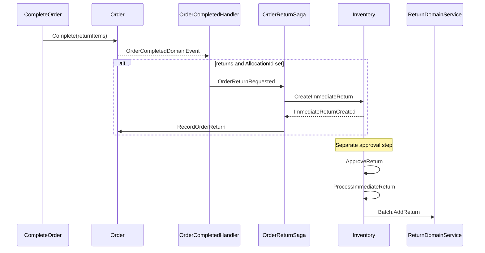

# Features

## Ordering
### Order lifecycle simplification
- Simplified `Order` to a single `OrderStatus` lifecycle (removed fulfillment metadata, dispatch/ship/refuse/reopen flows).
- Added `Order.Accept`, `Order.RequestRevision`, and `Order.Revise` transitions; `RevisionPending` status.
- `OrderSaga` orchestrates allocation request, record allocation, allocation failure/success revise, and mark-order-allocated flows.
- `OrderReturnSaga` orchestrates immediate-return creation and links `Order.ReturnId` after completion with return lines.
- `CompleteOrder` now records optional return lines inline and always completes the order (no separate return-items step).

## Inventory
### Allocation aggregate and FIFO reservation
- Introduced `Allocation` / `AllocationLine` aggregates with `AllocationDomainService` for FIFO stock reservation and release.
- `RequestAllocation` → `AllocationInitiated` → `AllocationSucceeded` / `AllocationFailed` integration events.
- `ReleaseAllocation` restores reserved stock and raises `AllocationReleased`.
- Removed legacy `OrderDispatchProcessed` and `DispatchOrder` command/consumer.

### Immediate return and stock restoration
- Added `Return` aggregate (TPH) with `ImmediateReturn` concrete type and `ReturnLine` children.
- Return lifecycle: `Pending` → `Approve()` → `Approved` → `ProcessImmediateReturn` → `Completed`.
- `ReturnDomainService.ProcessImmediateReturn` restores stock via `Batch.AddReturn` (descending `BatchId` order across original allocation batches).
- **Stock is not restored at order completion** — restoration is gated behind `ApproveReturnCommand` (MediatR only; no HTTP endpoint yet).

## Reporting
### Simplified reported order model
- Removed fulfillment metadata, failure-detail, and state-transition tables from reported orders to align with simplified order model.

# API Changes

## Ordering
### Complete Order (`POST /orders/{id}/complete`)
- Optional `items` array in request body for return lines (`orderItemId`, `quantity`). May be omitted, empty, or populated.
- Marks the order as completed when allowed; return lines are recorded at completion.

### Request Order Revision (`POST /orders/{id}/request-revision`) — **new**
- Moves an allocated processing order to `RevisionPending` and clears the allocated indicator.

### Removed endpoints (breaking)
| Endpoint | Replacement |
|----------|-------------|
| `POST /orders/{id}/return-items` | Return lines at `POST /orders/{id}/complete` |
| `POST /orders/{id}/dispatch` | Removed (lifecycle simplified) |
| `POST /orders/{id}/ship` | Removed |
| `POST /orders/{id}/refuse` | Removed |
| `POST /orders/{id}/reopen` | `POST /orders/{id}/request-revision` + revise flow |

### DTO / contract changes
- `OrderDto`: removed fulfillment-related fields; retains `ReturnItems`, payment summaries.
- `OrderStatus`: added `RevisionPending`; removed fulfillment-specific statuses.
- `OrderModel` renamed from `OrderIntegrationPayload` (namespace reorganized under `Orders/` bounded context folders).

## Inventory
- No new public HTTP endpoints. Return processing is integration-event / MediatR driven.

# Code Changes

## Ordering

### Domain (`Invoria.Ordering.Domain`)
- `Order.Complete(returnItems?)` records return lines, refreshes payment summary, raises `OrderCompletedDomainEvent`.
- `Order.RecordReturn(returnId)` persists link to Inventory return on completed orders.
- `Order.RecordAllocation`, `OrderAllocated` flag, `AllocationId`, `ReturnId` properties.
- `Order.Accept`, `Order.RequestRevision`, `Order.Revise` domain methods and associated domain events.
- Removed dispatch/ship/refuse/reopen domain methods and fulfillment metadata.

### Application (`Invoria.Ordering.Application`)
- `OrderCompletedDomainEventHandler` — publishes `OrderReturnRequestedIntegrationEvent` when `ReturnItems.Count > 0` and `AllocationId` is set.
- `OrderReturnSaga` / `OrderReturnSagaState` — correlates on `OrderId`; maps to `CreateImmediateReturnIntegrationEvent`; publishes `RecordOrderReturnSagaActivity`.
- `OrderSaga` / `OrderSagaState` — full allocation/revise orchestration (initiated by `OrderCreatedIntegrationEvent`).
- Commands: `RecordOrderReturn`, `RecordOrderAllocation`, `MarkOrderAllocated`, `RequestOrderRevision`, `ReviseOrder`, `CompleteOrder` (extended).
- Saga activity handlers: `RecordOrderReturnSagaActivityHandler`, `RecordOrderAllocationSagaActivityHandler`, `MarkOrderAllocatedSagaActivityHandler`, `ReviseOrderSagaActivityHandler`.
- Integration event consumers for allocation succeeded/failed/released and order revision requested.
- Removed: `AddReturnItems`, `DispatchOrder`, `ShipOrder`, `RefuseOrder`, `ReopenOrder`, allocation-failure/succeeded record commands.

### Infrastructure (`Invoria.Ordering.Infrastructure`)
- Migrations: `RemoveOrderFulfillmentMetadata`, `AddOrderAllocationId`, `AddOrderOrderAllocated`, `AddOrderReturnId`.
- Rebus: registers `OrderSaga`, `OrderReturnSaga`, saga activity handlers, allocation/revision integration consumers.
- Saga storage registration.

### Endpoints / Presentation (`Invoria.Ordering.Endpoints`)
- `CompleteOrderEndpoint` — accepts optional `items` for return lines.
- `RequestOrderRevisionEndpoint` — new.
- Removed: `AddReturnItemsEndpoint`, `DispatchOrderEndpoint`, `ShipOrderEndpoint`, `RefuseOrderEndpoint`, `ReopenOrderEndpoint`.

### Contracts (`Invoria.Ordering.Contracts`)
- Added: `OrderReturnRequestedIntegrationEvent`, `OrderReturnLineModel`, `OrderRevisionRequestedIntegrationEvent`, `OrderAcceptedIntegrationEvent`, `OrderCompletedDomainEvent` (domain).
- Reorganized under `Orders/Events`, `Orders/Models`, `Orders/Dtos`, `Orders/Enums` bounded context folders.

### Testing
- `Invoria.Ordering.Application.Tests`: domain tests for complete with returns, `RecordReturn`, accept/revise/revision-pending, allocation recording; `OrderReturnSagaTests`, `OrderSagaTests` (Rebus `SagaFixture`), `OrderCompletedDomainEventHandlerTests`, handler/consumer/saga activity tests.
- `Invoria.Ordering.Endpoints.Tests`: updated `CompleteOrderEndpointTests`; removed dispatch/ship/refuse/return-items tests; added `RequestOrderRevisionEndpointTests`.

## Inventory

### Domain (`Invoria.Inventory.Domain`)
- `Allocation` / `AllocationLine` aggregates with status transitions and domain events (`AllocationInitiated`, `AllocationCompleted`, `AllocationFailed`, `AllocationReleased`).
- `AllocationDomainService` — FIFO `Allocate` and `Release` across allocation lines and batches.
- `Return` / `ImmediateReturn` / `ReturnLine` aggregates with `ReturnType` TPH discriminator and `ReturnStatus` lifecycle.
- `ReturnDomainService.ProcessImmediateReturn` — restores stock via `Batch.AddReturn` (descending `BatchId` order).
- `Batch.AddReturn` — increases `Quantity`, reactivates depleted batches.
- Removed `OrderDispatchProcessed` and legacy dispatch-related batch behavior.

### Application (`Invoria.Inventory.Application`)
- Allocation: `RequestAllocation`, `ReleaseAllocation`, `CreateAllocate` commands and handlers; domain event handlers publishing `AllocationCreated`, `AllocationSucceeded`, `AllocationFailed`, `AllocationReleased` integration events.
- Returns: `CreateImmediateReturn`, `ApproveReturn`, `ProcessImmediateReturn` commands and handlers.
- Rebus consumers: `CreateImmediateReturnIntegrationEventConsumer`, `ProcessImmediateReturnIntegrationEventConsumer`, `RequestAllocationIntegrationEventConsumer`, `ReleaseAllocationIntegrationEventConsumer`, `AllocationCreatedIntegrationEventConsumer`.
- Domain event handlers: `ImmediateReturnCreatedDomainEventHandler`, `ReturnApprovedDomainEventHandler`.

### Infrastructure (`Invoria.Inventory.Infrastructure`)
- Migrations: `AddAllocationAggregate`, `DropAllocationsOrderIdUniqueIndex`, `DropOrderDispatchProcessed`, `RemoveBatchAllocationNavigations`, `AddReturnAggregate`, `AddReturnStatus`, `MoveReturnOrderIdToImmediateReturn`.
- `IInventoryUnitOfWork` / `InventoryUnitOfWork` for transactional boundaries.
- `DomainServiceInstaller` registers `IAllocationDomainService` and `IReturnDomainService`.
- EF TPH configuration for `Return` / `ImmediateReturn` and `ReturnLine` cascade.
- Rebus handler/subscription registration for allocation and return integration events.

### Endpoints / Presentation (`Invoria.Inventory.Endpoints`)
- No changes introduced in this layer.

### Contracts (`Invoria.Inventory.Contracts`)
- Reorganized under `Allocations/`, `Returns/`, `Batches/`, `Stock/` bounded context folders.
- Allocation events: `AllocateOrderIntegrationEvent`, `AllocationCreatedIntegrationEvent`, `AllocationSucceededIntegrationEvent`, `AllocationFailedIntegrationEvent`, `AllocationReleasedIntegrationEvent`, `ReleaseAllocationIntegrationEvent`, `RequestAllocationIntegrationEvent`.
- Return events: `CreateImmediateReturnIntegrationEvent`, `ImmediateReturnCreatedIntegrationEvent`, `ProcessImmediateReturnIntegrationEvent`.
- Models: `AllocateOrderLineModel`, `AllocationLineModel`, `AllocationModel`, `ReturnLineModel`.
- Enums: `ReturnType`, `ReturnStatus`.

### Testing
- `Invoria.Inventory.Application.Tests`: allocation domain service, allocation aggregate, release/request handlers, consumers; return lifecycle, `ReturnDomainService` batch-restore order, `ProcessImmediateReturnCommandHandlerTests` (end-to-end stock restore); `ApproveReturnCommandHandlerTests`, integration event consumer tests.

## Reporting

### Domain (`Invoria.Reporting.Domain`)
- Removed `ReportedOrderFailureDetail`, `ReportedOrderStateTransition` entities.
- Simplified `ReportedOrder` (removed fulfillment metadata).

### Application (`Invoria.Reporting.Application`)
- Updated rollup refreshers and query handlers for simplified order snapshot.

### Infrastructure (`Invoria.Reporting.Infrastructure`)
- Migration: `RemoveReportedOrderFulfillmentMetadata`.
- Removed EF configurations for failure detail and state transition tables.

### Endpoints / Presentation (`Invoria.Reporting.Endpoints`)
- No structural changes; existing endpoints return simplified order data.

### Contracts (`Invoria.Reporting.Contracts`)
- No changes introduced in this layer.

### Testing
- `Invoria.Reporting.Application.Tests`: updated rollup and query tests for simplified order snapshot.

# Cross-cutting

## Host / API (`Invoria.Api`)
- `ApiModuleInstaller` — routes `Inventory.Contracts` integration events in Rebus.

## BuildingBlocks (`Invoria.BuildingBlocks.*`)
- `IUnitOfWork` / `IUnitOfWorkTransaction` — transactional abstractions in `Invoria.BuildingBlocks.Core`.
- `EfUnitOfWork` — EF Core implementation in `Invoria.BuildingBlocks.EntityFramework`.
- `IDomainService` marker interface in `Invoria.BuildingBlocks.Domain`.
- `AddInvoriaUnitOfWork` registration extension.

## Shared validation or global behaviors
- Cursor rules added/updated: `commands.mdc`, `domain-service.mdc`, `module-contracts.mdc`, `command-handler-orchestration.mdc`.
- `ai/Architecture.md` updated with allocation flow, immediate return flow, return approval flow, and contract layout.

# Integration and messaging

## Cross-module integration events

| Event | Publisher | Consumer |
|-------|-----------|----------|
| `OrderReturnRequestedIntegrationEvent` | Ordering (`OrderCompletedDomainEventHandler`) | Ordering (`OrderReturnSaga`) |
| `CreateImmediateReturnIntegrationEvent` | Ordering saga | Inventory |
| `ImmediateReturnCreatedIntegrationEvent` | Inventory | Ordering (`OrderReturnSaga`) |
| `ProcessImmediateReturnIntegrationEvent` | Inventory (`ReturnApprovedDomainEventHandler`) | Inventory |
| `AllocationCreatedIntegrationEvent` | Inventory | Ordering saga |
| `AllocationSucceededIntegrationEvent` | Inventory | Ordering saga |
| `AllocationFailedIntegrationEvent` | Inventory | Ordering saga |
| `AllocationReleasedIntegrationEvent` | Inventory | Ordering saga |
| `OrderRevisionRequestedIntegrationEvent` | Ordering | Ordering saga |
| `OrderAcceptedIntegrationEvent` | Ordering | Inventory (allocate via `OrderSaga`) |
| `AllocateOrderIntegrationEvent` | Ordering saga | Inventory |
| `RequestAllocationIntegrationEvent` | Inventory | Inventory |
| `ReleaseAllocationIntegrationEvent` | Ordering saga | Inventory |

## Rebus subscriptions to verify on deploy
- **Ordering:** saga events + `RecordOrderReturnSagaActivity`, allocation/revision consumers.
- **Inventory:** `RequestAllocation`, `ReleaseAllocation`, `CreateImmediateReturn`, `ProcessImmediateReturn`, `AllocateOrder`.

# Test plan

- [ ] Run full solution test suite (`dotnet test`).
- [ ] Complete order **without** return items — no `OrderReturnRequested` published; stock unchanged.
- [ ] Complete order **with** return items and `AllocationId` — `Order.ReturnId` populated after saga; Inventory `ImmediateReturn` in `Pending`.
- [ ] Run `ApproveReturnCommand` (or future endpoint) — `ProcessImmediateReturn` increases batch quantities; `ProductStockService` reflects restored stock.
- [ ] Complete order with returns but **no** `AllocationId` — saga skipped (no error).
- [ ] Verify removed endpoints return 404.
- [ ] Apply all EF migrations (Ordering, Inventory, Reporting) on a clean database.
- [ ] Regression: order accept → allocation → revise on failure → re-allocate flow via `OrderSaga`.

# Deployment / breaking-change notes

1. **Coordinated deploy required** — Ordering, Inventory, and Reporting schema changes must ship together.
2. **EF migrations** (run in order per module):
   - **Inventory:** `AddAllocationAggregate` → `DropAllocationsOrderIdUniqueIndex` → `DropOrderDispatchProcessed` → `RemoveBatchAllocationNavigations` → `AddReturnAggregate` → `AddReturnStatus` → `MoveReturnOrderIdToImmediateReturn`
   - **Ordering:** `RemoveOrderFulfillmentMetadata` → `AddOrderAllocationId` → `AddOrderOrderAllocated` → `AddOrderReturnId`
   - **Reporting:** `RemoveReportedOrderFulfillmentMetadata`
3. **API clients** must stop calling removed dispatch/ship/refuse/reopen/return-items endpoints.
4. **Operational gap:** immediate returns created at order completion stay `Pending` until `ApproveReturn` runs — consider follow-up to auto-approve or expose an HTTP endpoint.
