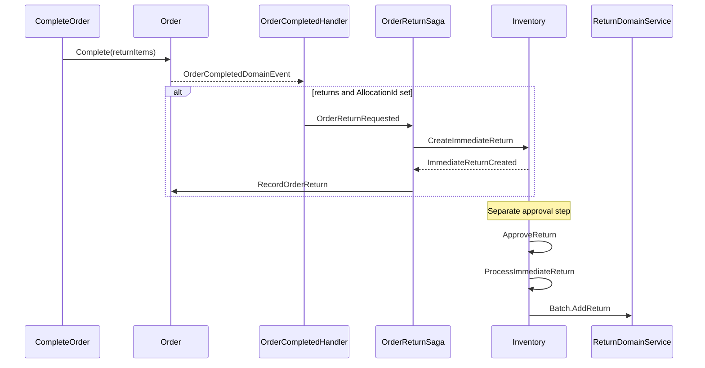

# Features

## Ordering
### Order lifecycle simplification
- Simplified `Order` to a single `OrderStatus` lifecycle (removed fulfillment metadata, dispatch/ship/refuse/reopen flows).
- Added `Order.Accept`, `Order.RequestRevision`, and `Order.Revise` transitions; `RevisionPending` status.
- **`OrderSaga`** / **`OrderSagaState`** — orchestrates allocation request, record allocation, allocation failure/success revise, and mark-order-allocated flows (initiated by `OrderCreatedIntegrationEvent`; states in `OrderSagaProcessState`).
- **`OrderReturnSaga`** / **`OrderReturnSagaState`** — orchestrates immediate-return creation and links `Order.ReturnId` after completion with return lines (states in `OrderReturnSagaProcessState`: `Requested`, `Created`).
- `CompleteOrder` now records optional return lines inline and always completes the order (no separate return-items step).

## Inventory
### Allocation aggregate and FIFO reservation
- Introduced **`Allocation`** / **`AllocationLine`** aggregates with **`IAllocationDomainService`** / **`AllocationDomainService`** for FIFO stock reservation and release.
- `AllocateOrderIntegrationEvent` → `Allocation` (`Pending`) → **`AllocationInitiatedDomainEvent`** → `RequestAllocationIntegrationEvent` → FIFO **`Allocate`** → **`AllocationSucceededIntegrationEvent`** or **`AllocationFailedIntegrationEvent`**.
- **`ReleaseAllocationIntegrationEvent`** → **`IAllocationDomainService.Release`** → **`AllocationReleasedIntegrationEvent`**.
- Removed legacy `OrderDispatchProcessed` and `DispatchOrder` command/consumer.

### Immediate return and stock restoration
- Added **`Return`** aggregate (TPH) with **`ImmediateReturn`** concrete type and **`ReturnLine`** children.
- Return lifecycle: `Pending` → `Approve()` → `Approved` → `ProcessImmediateReturn` → `Completed` (per `Invoria.Inventory.Contracts.Returns.Enums.ReturnStatus`).
- **`IReturnDomainService.ProcessImmediateReturn`** restores stock via **`Batch.AddReturn`** (by `BatchAllocation.BatchId` descending), then calls **`Return.Complete()`**.
- **Stock is not restored at order completion** — restoration is gated behind **`ApproveReturnCommand`** (MediatR only; no HTTP endpoint yet).

## Reporting
### Simplified reported order model
- Removed fulfillment metadata, **`ReportedOrderFailureDetail`**, and **`ReportedOrderStateTransition`** tables to align with simplified order model.

# API Changes

## Ordering
### Complete Order (`POST /orders/{id}/complete`)
- Optional `items` array in request body for return lines (`orderItemId`, `quantity`). May be omitted, empty, or populated.
- Marks the order as completed when allowed; return lines are recorded at completion.

### Request Order Revision (`POST /orders/{id}/request-revision`) — **new**
- Moves an allocated processing order to `RevisionPending` and clears the allocated indicator.

### Removed endpoints (breaking)
| Endpoint | Replacement |
|----------|-------------|
| `POST /orders/{id}/return-items` | Return lines at `POST /orders/{id}/complete` |
| `POST /orders/{id}/dispatch` | Removed (lifecycle simplified) |
| `POST /orders/{id}/ship` | Removed |
| `POST /orders/{id}/refuse` | Removed |
| `POST /orders/{id}/reopen` | `POST /orders/{id}/request-revision` + revise flow |

### DTO / contract changes
- `OrderDto`: removed fulfillment-related fields; retains `ReturnItems`, payment summaries.
- `OrderStatus`: added `RevisionPending`; removed fulfillment-specific statuses.
- `OrderModel` renamed from `OrderIntegrationPayload` (namespace reorganized under `Orders/` bounded context folders per `.cursor/rules/module-contracts.mdc`).

## Inventory
- No new public HTTP endpoints. Return processing is integration-event / MediatR driven.

## Catalog
- No HTTP endpoint changes. `ProductDto.Stock` namespace updated to `Invoria.Inventory.Contracts.Stock.Dtos`.

## Procurement
- No changes introduced in this module.

# Code Changes

## Ordering

### Domain (`Invoria.Ordering.Domain`)
- `Order.Complete(returnItems?)` records return lines, refreshes payment summary, raises **`OrderCompletedDomainEvent`**.
- `Order.RecordReturn(returnId)` persists link to Inventory return on completed orders.
- `Order.RecordAllocation`, `OrderAllocated` flag, `AllocationId`, `ReturnId` properties.
- `Order.Accept`, `Order.RequestRevision`, `Order.Revise` domain methods and associated domain events.
- Removed dispatch/ship/refuse/reopen domain methods and fulfillment metadata.

### Application (`Invoria.Ordering.Application`)
- **`OrderCompletedDomainEventHandler`** — publishes **`OrderReturnRequestedIntegrationEvent`** when `ReturnItems.Count > 0` and `AllocationId` is set.
- **`OrderReturnSaga`** — correlates on `OrderId`; maps to **`CreateImmediateReturnIntegrationEvent`**; publishes **`RecordOrderReturnSagaActivity`**.
- **`OrderSaga`** — handles `OrderAcceptedIntegrationEvent`, `AllocationCreatedIntegrationEvent`, `AllocationSucceededIntegrationEvent`, `AllocationFailedIntegrationEvent`, `AllocationReleasedIntegrationEvent`, `OrderRevisionRequestedIntegrationEvent`.
- Commands: `RecordOrderReturn`, `RecordOrderAllocation`, `MarkOrderAllocated`, `RequestOrderRevision`, `ReviseOrder`, `CompleteOrder` (extended).
- Saga activity handlers: `RecordOrderReturnSagaActivityHandler`, `RecordOrderAllocationSagaActivityHandler`, `MarkOrderAllocatedSagaActivityHandler`, `ReviseOrderSagaActivityHandler`.
- Removed: `AddReturnItems`, `DispatchOrder`, `ShipOrder`, `RefuseOrder`, `ReopenOrder`, allocation-failure/succeeded record commands.

### Infrastructure (`Invoria.Ordering.Infrastructure`)
- Migrations: `RemoveOrderFulfillmentMetadata`, `AddOrderAllocationId`, `AddOrderOrderAllocated`, `AddOrderReturnId`.
- **`RebusHandlersServiceInstaller`** — registers `OrderSaga`, `OrderReturnSaga`, saga activity handlers, integration consumers.
- **`OrderingModuleBootStrapper`** — subscribes saga events and integration events at startup.

### Endpoints / Presentation (`Invoria.Ordering.Endpoints`)
- `CompleteOrderEndpoint` — accepts optional `items` for return lines.
- `RequestOrderRevisionEndpoint` — new.
- Removed: `AddReturnItemsEndpoint`, `DispatchOrderEndpoint`, `ShipOrderEndpoint`, `RefuseOrderEndpoint`, `ReopenOrderEndpoint`.

### Contracts (`Invoria.Ordering.Contracts`)
- Layout: `Orders/Enums/`, `Orders/Dtos/`, `Orders/Events/`, `Orders/Models/`.
- Added: **`OrderReturnRequestedIntegrationEvent`**, **`OrderReturnLineModel`**, **`OrderRevisionRequestedIntegrationEvent`**, **`OrderAcceptedIntegrationEvent`**.

### Testing
- `Invoria.Ordering.Application.Tests`: domain tests for complete with returns, `RecordReturn`, accept/revise/revision-pending, allocation recording; `OrderReturnSagaTests`, `OrderSagaTests` (Rebus `SagaFixture`), `OrderCompletedDomainEventHandlerTests`, handler/consumer/saga activity tests.
- `Invoria.Ordering.Endpoints.Tests`: updated `CompleteOrderEndpointTests`; removed dispatch/ship/refuse/return-items tests; added `RequestOrderRevisionEndpointTests`.

## Inventory

### Domain (`Invoria.Inventory.Domain`)
- **`Allocation`** / **`AllocationLine`** with domain events: **`AllocationInitiatedDomainEvent`**, **`AllocationCompletedDomainEvent`**, **`AllocationFailedDomainEvent`**, **`AllocationReleasedDomainEvent`**.
- **`IAllocationDomainService`** / **`AllocationDomainService`** — FIFO **`Allocate`** and **`Release`**.
- **`Return`** / **`ImmediateReturn`** / **`ReturnLine`** with TPH `ReturnType` discriminator.
- **`IReturnDomainService`** / **`ReturnDomainService`** — **`ProcessImmediateReturn`**.
- **`Batch.AddReturn`** — increases `Quantity`, reactivates depleted batches.
- **`IInventoryUnitOfWork`** — module unit-of-work port backed by **`EfUnitOfWork<InventoryDbContext>`**.

### Application (`Invoria.Inventory.Application`)
- Allocation: **`CreateAllocateCommand`**, **`RequestAllocationCommand`**, **`ReleaseAllocationCommand`** and handlers.
- Domain event handlers: **`AllocationInitiatedDomainEventHandler`**, **`AllocationCompletedDomainEventHandler`**, **`AllocationFailedDomainEventHandler`**, **`AllocationReleasedDomainEventHandler`**.
- Returns: **`CreateImmediateReturnCommand`**, **`ApproveReturnCommand`**, **`ProcessImmediateReturnCommand`** and handlers.
- Rebus consumers: **`AllocateOrderIntegrationEventConsumer`**, **`RequestAllocationIntegrationEventConsumer`**, **`ReleaseAllocationIntegrationEventConsumer`**, **`AllocationCreatedIntegrationEventConsumer`**, **`CreateImmediateReturnIntegrationEventConsumer`**, **`ProcessImmediateReturnIntegrationEventConsumer`**.
- Domain event handlers: **`ImmediateReturnCreatedDomainEventHandler`**, **`ReturnApprovedDomainEventHandler`**.

### Infrastructure (`Invoria.Inventory.Infrastructure`)
- Migrations: `AddAllocationAggregate`, `DropAllocationsOrderIdUniqueIndex`, `DropOrderDispatchProcessed`, `RemoveBatchAllocationNavigations`, `AddReturnAggregate`, `AddReturnStatus`, `MoveReturnOrderIdToImmediateReturn`.
- **`DomainServiceInstaller`** — registers **`IAllocationDomainService`**, **`IReturnDomainService`**.
- EF TPH: **`ReturnEntityTypeConfiguration`**, **`ImmediateReturnEntityTypeConfiguration`**, **`ReturnLineEntityTypeConfiguration`**.
- **`InventoryModuleBootStrapper`** — subscribes `AllocateOrderIntegrationEvent`, `AllocationCreatedIntegrationEvent`, `ReleaseAllocationIntegrationEvent`, `CreateImmediateReturnIntegrationEvent`, `ProcessImmediateReturnIntegrationEvent`.

### Endpoints / Presentation (`Invoria.Inventory.Endpoints`)
- No changes introduced in this layer.

### Contracts (`Invoria.Inventory.Contracts`)
- Layout: `Allocations/`, `Returns/`, `Batches/`, `Stock/` bounded context folders.
- Allocation events: **`AllocateOrderIntegrationEvent`**, **`AllocationCreatedIntegrationEvent`**, **`AllocationSucceededIntegrationEvent`**, **`AllocationFailedIntegrationEvent`**, **`AllocationReleasedIntegrationEvent`**, **`ReleaseAllocationIntegrationEvent`**, **`RequestAllocationIntegrationEvent`**.
- Return events: **`CreateImmediateReturnIntegrationEvent`**, **`ImmediateReturnCreatedIntegrationEvent`**, **`ProcessImmediateReturnIntegrationEvent`**.
- Models: **`AllocateOrderLineModel`**, **`AllocationLineModel`**, **`AllocationModel`**, **`ReturnLineModel`**.
- Enums: **`ReturnType`**, **`ReturnStatus`**.

### Testing
- `Invoria.Inventory.Application.Tests`: allocation domain service, allocation aggregate, release/request handlers, consumers; return lifecycle, `ReturnDomainService` batch-restore order, `ProcessImmediateReturnCommandHandlerTests` (end-to-end stock restore); `ApproveReturnCommandHandlerTests`, integration event consumer tests.

## Reporting

### Domain (`Invoria.Reporting.Domain`)
- Removed **`ReportedOrderFailureDetail`**, **`ReportedOrderStateTransition`** entities.
- Simplified **`ReportedOrder`** (removed fulfillment metadata).

### Application (`Invoria.Reporting.Application`)
- Updated rollup refreshers and query handlers for simplified order snapshot.

### Infrastructure (`Invoria.Reporting.Infrastructure`)
- Migration: `RemoveReportedOrderFulfillmentMetadata`.
- Removed EF configurations for failure detail and state transition tables.

### Endpoints / Presentation (`Invoria.Reporting.Endpoints`)
- No structural changes; existing endpoints return simplified order data.

### Contracts (`Invoria.Reporting.Contracts`)
- No changes introduced in this layer.

### Testing
- `Invoria.Reporting.Application.Tests`: updated rollup and query tests for simplified order snapshot.

## Catalog

### Contracts (`Invoria.Catalog.Contracts`)
- `ProductDto.Stock` type reference updated to `Invoria.Inventory.Contracts.Stock.Dtos.StockDto`.

### Application (`Invoria.Catalog.Application`)
- `ProductResposneFactory` updated for reorganized Inventory contract namespace.

### Domain / Infrastructure / Endpoints / Testing
- No changes introduced in these layers.

## Procurement

- No changes introduced in this module.

# Cross-cutting

## Host / API (`Invoria.Api`)
- **`ApiModuleInstaller`** — routes `Inventory.Contracts` integration events in Rebus; saga storage in SQL Server (`RebusSagas`, `RebusSagaIndex`).

## BuildingBlocks (`Invoria.BuildingBlocks.*`)
- **`IUnitOfWork`** / **`IUnitOfWorkTransaction`** — `Invoria.BuildingBlocks.Domain` transaction boundary abstractions.
- **`EfUnitOfWork<TContext>`** — `Invoria.BuildingBlocks.EntityFramework`; register via **`AddInvoriaUnitOfWork<TContext>()`**.
- **`IDomainService`** marker interface — implemented by **`AllocationDomainService`**, **`ReturnDomainService`**.

## Shared validation or global behaviors
- Cursor rules: `commands.mdc`, `domain-service.mdc`, `module-contracts.mdc`, `command-handler-orchestration.mdc`.
- **`ai/Architecture.md`** updated: allocation flow, immediate return flow, return approval flow, `OrderReturnSaga`, contract layout.

# Integration and messaging

Flows below mirror [`ai/Architecture.md`](../Architecture.md) vocabulary and step order.

## Order completion with returns (Ordering → Inventory)

1. `CompleteOrderCommand` → `Order.Complete(returnItems)` → **`OrderCompletedDomainEvent`**.
2. **`OrderCompletedDomainEventHandler`** — guard: `ReturnItems.Count > 0` and `AllocationId` set.
3. Publishes **`OrderReturnRequestedIntegrationEvent`** (`OrderId`, `AllocationId`, `Lines`).
4. **`OrderReturnSaga`** (state `Requested`) → **`CreateImmediateReturnIntegrationEvent`**.
5. **`CreateImmediateReturnIntegrationEventConsumer`** → **`CreateImmediateReturnCommand`** → **`ImmediateReturn.Create`** (`Pending`) → **`ImmediateReturnCreatedDomainEvent`**.
6. **`ImmediateReturnCreatedDomainEventHandler`** → **`ImmediateReturnCreatedIntegrationEvent`**.
7. **`OrderReturnSaga`** (state `Created`) → **`RecordOrderReturnSagaActivity`**.
8. **`RecordOrderReturnSagaActivityHandler`** → **`RecordOrderReturnCommand`** → `Order.RecordReturn(returnId)`.

## Return approval and stock restoration (Inventory)

1. **`ApproveReturnCommandHandler`** → `Return.Approve()` → **`ReturnApprovedDomainEvent`**.
2. **`ReturnApprovedDomainEventHandler`** → **`ProcessImmediateReturnIntegrationEvent`** (when `ReturnType.Immediate`).
3. **`ProcessImmediateReturnIntegrationEventConsumer`** → **`ProcessImmediateReturnCommand`**.
4. **`ProcessImmediateReturnCommandHandler`** — loads aggregates and batches via **`IInventoryUnitOfWork`**.
5. **`IReturnDomainService.ProcessImmediateReturn`** → **`Batch.AddReturn`** → **`Return.Complete()`**.

## Order allocation flow (Ordering ↔ Inventory)

1. **`OrderAcceptedIntegrationEvent`** → **`OrderSaga`** → **`AllocateOrderIntegrationEvent`**.
2. **`AllocateOrderIntegrationEventConsumer`** → **`CreateAllocateCommand`** → `Allocation` (`Pending`).
3. **`AllocationInitiatedDomainEvent`** → **`RequestAllocationIntegrationEvent`**.
4. **`RequestAllocationIntegrationEventConsumer`** → **`RequestAllocationCommand`** → **`IAllocationDomainService.Allocate`**.
5. Success: **`AllocationCompletedDomainEvent`** → **`AllocationSucceededIntegrationEvent`** → Ordering saga records allocation.
6. Failure: **`AllocationFailedDomainEvent`** → **`AllocationFailedIntegrationEvent`** → Ordering saga revise flow.
7. Release: **`ReleaseAllocationIntegrationEvent`** → **`IAllocationDomainService.Release`** → **`AllocationReleasedIntegrationEvent`**.

## Cross-module integration events

| Event | Publisher | Consumer |
|-------|-----------|----------|
| `OrderReturnRequestedIntegrationEvent` | Ordering (`OrderCompletedDomainEventHandler`) | Ordering (`OrderReturnSaga`) |
| `CreateImmediateReturnIntegrationEvent` | Ordering saga | Inventory |
| `ImmediateReturnCreatedIntegrationEvent` | Inventory | Ordering (`OrderReturnSaga`) |
| `ProcessImmediateReturnIntegrationEvent` | Inventory (`ReturnApprovedDomainEventHandler`) | Inventory |
| `AllocationCreatedIntegrationEvent` | Inventory | Ordering saga |
| `AllocationSucceededIntegrationEvent` | Inventory | Ordering saga |
| `AllocationFailedIntegrationEvent` | Inventory | Ordering saga |
| `AllocationReleasedIntegrationEvent` | Inventory | Ordering saga |
| `OrderRevisionRequestedIntegrationEvent` | Ordering | Ordering saga |
| `OrderAcceptedIntegrationEvent` | Ordering | Ordering saga |
| `AllocateOrderIntegrationEvent` | Ordering saga | Inventory |
| `RequestAllocationIntegrationEvent` | Inventory | Inventory |
| `ReleaseAllocationIntegrationEvent` | Ordering saga | Inventory |

## Rebus subscriptions (bootstrap)

Per **`OrderingModuleBootStrapper`** and **`InventoryModuleBootStrapper`**:

- **Ordering:** `OrderCreatedIntegrationEvent`, `OrderAcceptedIntegrationEvent`, `AllocationCreatedIntegrationEvent`, `AllocationFailedIntegrationEvent`, `AllocationSucceededIntegrationEvent`, `AllocationReleasedIntegrationEvent`, `OrderRevisionRequestedIntegrationEvent`, `OrderReturnRequestedIntegrationEvent`, `ImmediateReturnCreatedIntegrationEvent`, saga activities (`RecordOrderAllocationSagaActivity`, `ReviseOrderSagaActivity`, `MarkOrderAllocatedSagaActivity`, `RecordOrderReturnSagaActivity`).
- **Inventory:** `AllocateOrderIntegrationEvent`, `AllocationCreatedIntegrationEvent`, `ReleaseAllocationIntegrationEvent`, `CreateImmediateReturnIntegrationEvent`, `ProcessImmediateReturnIntegrationEvent`.

# Test plan

- [ ] Run full solution test suite (`dotnet test`).
- [ ] Complete order **without** return items — no `OrderReturnRequested` published; stock unchanged.
- [ ] Complete order **with** return items and `AllocationId` — `Order.ReturnId` populated after saga; Inventory `ImmediateReturn` in `Pending`.
- [ ] Run `ApproveReturnCommand` — `ProcessImmediateReturn` increases batch quantities; `ProductStockService` reflects restored stock.
- [ ] Complete order with returns but **no** `AllocationId` — saga skipped (no error).
- [ ] Verify removed endpoints return 404.
- [ ] Apply all EF migrations (Ordering, Inventory, Reporting) on a clean database.
- [ ] Regression: order accept → allocation → revise on failure → re-allocate flow via `OrderSaga`.

# Deployment / breaking-change notes

1. **Coordinated deploy required** — Ordering, Inventory, and Reporting schema changes must ship together.
2. **EF migrations** (run in order per module):
   - **Inventory:** `AddAllocationAggregate` → `DropAllocationsOrderIdUniqueIndex` → `DropOrderDispatchProcessed` → `RemoveBatchAllocationNavigations` → `AddReturnAggregate` → `AddReturnStatus` → `MoveReturnOrderIdToImmediateReturn`
   - **Ordering:** `RemoveOrderFulfillmentMetadata` → `AddOrderAllocationId` → `AddOrderOrderAllocated` → `AddOrderReturnId`
   - **Reporting:** `RemoveReportedOrderFulfillmentMetadata`
3. **API clients** must stop calling removed dispatch/ship/refuse/reopen/return-items endpoints.
4. **Operational gap:** immediate returns created at order completion stay `Pending` until `ApproveReturn` runs — consider follow-up to auto-approve or expose an HTTP endpoint.
