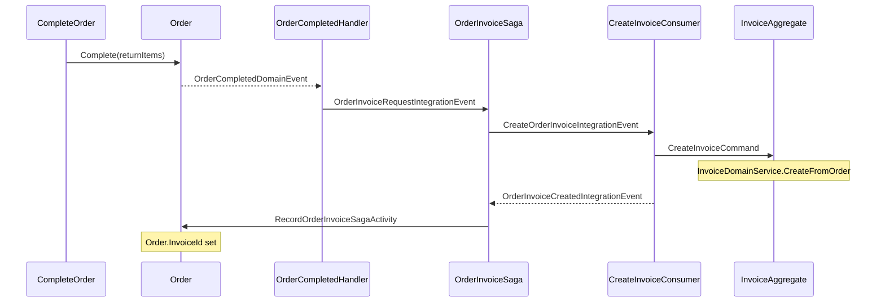

# Features

## Ordering

### Invoice aggregate and domain service
- **`Invoice`** / **`InvoiceItem`** — new `AuditedAggregateRoot` with header properties (`InvoiceNumber`, `CustomerId`, `OrderId`, `Subtotal`, `TotalPrice`) and line items.
- **`IInvoiceDomainService`** / **`InvoiceDomainService`** — `CreateFromOrder(Order, invoiceNumber)` maps `Order.GetBillableItems()` to `InvoiceItem` list, deducting returned quantities. Throws if no billable items remain.
- **`IInvoiceNumberGenerator`** / **`InvoiceNumberGenerator`** — daily counter pattern producing `yyMMdd####` numbers with per-day monotonic reset (backed by `IInvoiceNumberSequence`).

### Order → Invoice saga orchestration
- **Order completion now fans out to invoice creation.** After `Order.Complete` → `OrderCompletedDomainEvent` → `OrderCompletedDomainEventHandler`, the completion handler routes to the `OrderInvoiceSaga` via `OrderInvoiceRequestIntegrationEvent`.
- **`OrderInvoiceSaga`** / **`OrderInvoiceSagaState`** — two-state (`Requested` → `Completed`, data in `OrderInvoiceSagaProcessState`). On `Requested`: publishes `CreateOrderInvoiceIntegrationEvent`. On reply `OrderInvoiceCreatedIntegrationEvent`: records `InvoiceId` and publishes `RecordOrderInvoiceSagaActivity` to persist `Order.InvoiceId`.
- **`RecordOrderInvoiceSagaActivity`** → `RecordOrderInvoiceCommand` → `Order.RecordInvoice(invoiceId)`.

### OrderReturnSaga state simplification
- Trimmed to `Requested` and `Completed` states only (removed intermediate `Created`).

### Invoice read endpoints
- `GET /invoices` (paged, filterable by `CustomerId` and `OrderId` query parameters).
- `GET /invoices/{id}` (single invoice with line items).

### Test folder reorganization
- `Invoria.Ordering.Application.Tests` restructured under `Orders/` and `Invoices/` bounded-context folders mirroring the module layout.

# API Changes

## Ordering

### List Invoices (`GET /invoices`) — **new**
| Parameter | Type | Description |
|-----------|------|-------------|
| `Skip` | int | Paging offset |
| `Length` | int | Page size |
| `CustomerId` | string? | Filter by customer |
| `OrderId` | string? | Filter by order |

Returns `Envelope<PagingDto<InvoiceDto>>` with `InvoiceDto.Items` containing line details.

### Get Invoice By Id (`GET /invoices/{id}`) — **new**
Returns `Envelope<InvoiceDto>` with nested `Items`. Returns 404 when not found.

### DTO / contract changes
- `InvoiceDto` — `Id`, `InvoiceNumber`, `CustomerId`, `OrderId`, `Subtotal`, `TotalPrice`, `Items` (list of `InvoiceItemDto`).
- `InvoiceItemDto` — `OrderItemId`, `ProductId`, `Quantity`, `Price`, `LineTotal`.
- New integration events in `Invoria.Ordering.Contracts.Invoices.Events`:
  - `OrderInvoiceRequestIntegrationEvent`
  - `CreateOrderInvoiceIntegrationEvent`
  - `OrderInvoiceCreatedIntegrationEvent`

## Inventory / Reporting / Catalog / Procurement
- No HTTP endpoint changes in this branch.

# Code Changes

## Ordering

### Domain (`Invoria.Ordering.Domain`)
- **`Invoice`** aggregate: `Create(…)` with guard clauses (`Id` via `Guid.NewGuid().ToString("N")`).
- **`InvoiceItem`** entity: `OrderItemId`, `ProductId`, `Quantity`, `Price`.
- **`IInvoiceDomainService`** / **`InvoiceDomainService`** — `CreateFromOrder` maps billable lines, aggregates totals.
- **`IInvoiceNumberGenerator`** / **`InvoiceNumberGenerator`** — daily counter via `IInvoiceNumberSequence` (singleton per day).
- `InvoiceTableConsts`, `InvoiceItemTableConsts`.

### Application (`Invoria.Ordering.Application`)
- **`CreateInvoiceCommand`** / handler — validates order is completed, calls `IInvoiceDomainService.CreateFromOrder`, persists via `IRepository<Invoice>.InsertAsync`, returns `InvoiceDto`.
- **`ListInvoicesQuery`** / handler — `IOrderingRepository<Invoice>.AsQuerable()` with optional `CustomerId` / `OrderId` filters, ordered by `Id` descending, returns `PagingDto<InvoiceDto>`.
- **`GetInvoiceByIdQuery`** / handler — single invoice lookup by id, returns `NotFoundException` on miss.
- **`RecordOrderInvoiceCommand`** / handler — sets `Order.InvoiceId`.
- **`OrderCompletedDomainEventHandler`** — extended to publish `OrderInvoiceRequestIntegrationEvent` on completion (fan-out to invoice saga).
- **`CreateOrderInvoiceIntegrationEventConsumer`** — receives event, dispatches `CreateInvoiceCommand`, publishes `OrderInvoiceCreatedIntegrationEvent`.
- **`RecordOrderInvoiceSagaActivityHandler`** — dispatches `RecordOrderInvoiceCommand`.
- **`IInvoiceResponseFactory`** / **`InvoiceResponseFactory`** — maps `Invoice` → `InvoiceDto`.
- **Invoice saga:** `OrderInvoiceSaga`, `OrderInvoiceSagaState`, `OrderInvoiceSagaProcessState`.
- **Saga activity:** `RecordOrderInvoiceSagaActivity`.

### Infrastructure (`Invoria.Ordering.Infrastructure`)
- **EF configurations:** `InvoiceEntityTypeConfiguration`, `InvoiceItemEntityTypeConfiguration` — table names, max lengths, auto-include items.
- **Migrations:** `20260619151749_AddInvoiceAggregate`, `20260619153609_AddOrderInvoiceId`, `20260619154151_RemoveOrderInvoiceIdUniqueIndex` (allow multiple invoices per order).
- **`DomainServiceInstaller`** — registers `IInvoiceDomainService`, `IInvoiceNumberGenerator`.
- **`RebusHandlersServiceInstaller`** — registers `OrderInvoiceSaga`, `CreateOrderInvoiceIntegrationEventConsumer`, `RecordOrderInvoiceSagaActivityHandler`.
- **`OrderingModuleBootStrapper`** — subscribes `OrderInvoiceRequestIntegrationEvent`, `OrderInvoiceCreatedIntegrationEvent`, saga activities.
- **`InvoiceNumberGenerator`** — persists sequences in a dedicated table (`InvoiceNumberSequences` via EF).

### Endpoints / Presentation (`Invoria.Ordering.Endpoints`)
- **`InvoiceRoutingGroup`** — `/invoices` tag group with standard problem-detail responses.
- **`ListInvoicesEndpoint`** — `GET ""` on group, maps `ListInvoicesRequest` to `ListInvoicesQuery`, returns `PagingDto<InvoiceDto>`.
- **`GetInvoiceByIdEndpoint`** — `GET "{id}"` on group, maps `GetInvoiceByIdRequest` to `GetInvoiceByIdQuery`, returns `InvoiceDto`.
- Request validators for both endpoints via `FluentValidation`.

### Contracts (`Invoria.Ordering.Contracts`)
- `Invoices/Dtos/InvoiceDto.cs`, `Invoices/Dtos/InvoiceItemDto.cs`.
- `Invoices/Events/CreateOrderInvoiceIntegrationEvent.cs`, `Invoices/Events/OrderInvoiceCreatedIntegrationEvent.cs`, `Invoices/Events/OrderInvoiceRequestIntegrationEvent.cs`.

### Testing
- `Invoria.Ordering.Application.Tests`:
  - `Domain/Invoices/` — `InvoiceTests` (construct, validate), `InvoiceDomainServiceTests` (deduct returns, throw on all-returned).
  - `Invoices/Commands/` — `CreateInvoiceCommandHandlerTests` (integration with `OrderTestFixture`; verifies persistence, returned-quantity deduction, `RecordOrderInvoice` link).
  - `Invoices/Queries/` — `ListInvoicesQueryHandlerTests` (paging, customer/order filters, ordering), `GetInvoiceByIdQueryHandlerTests` (found, not-found).
  - `Invoices/Consumers/` — `CreateOrderInvoiceIntegrationEventConsumerTests` (sends command, publishes result event).
  - `Invoices/Sagas/` — `OrderInvoiceSagaTests` (requested, completed, orphan safe), `OrderInvoiceSagaStateTests`, `RecordOrderInvoiceSagaActivityHandlerTests`.
  - `Orders/Sagas/` — `OrderSagaTests` (completion fan-out to invoice saga), `OrderReturnSagaTests` (simplified Requested/Completed states).
  - `Domain/Orders/` — `OrderBillableItemsDomainTests`, `OrderMarkAsAllocatedDomainTests`, `OrderRecordAllocationDomainTests`, `OrderRecordInvoiceDomainTests`, `OrderRecordReturnDomainTests`.
  - `Assertions/` — `InvoiceAssertionExtensions.AssertInvoiceDto`.

- `Invoria.Ordering.Endpoints.Tests`:
  - `Invoices/` — `ListInvoicesEndpointTests` (paged retrieval, `OrderId` filter), `GetInvoiceByIdEndpointTests` (found with items, 404).

## Inventory
- No changes introduced in this branch.

## Reporting
- No changes introduced in this branch.

## Catalog
- No changes introduced in this branch.

## Procurement
- No changes introduced in this branch.

# Cross-cutting

## Host / API (`Invoria.Api`)
- **`ApiModuleInstaller`** — routes new `Ordering.Contracts.Invoices.Events` integration events in Rebus.

## BuildingBlocks (`Invoria.BuildingBlocks.*`)
- No new abstractions in this branch.

## Documentation
- **`ai/Architecture.md`** — documented invoice creation flow, order-invoice one-to-one link, `IInvoiceNumberGenerator`, `OrderReturnSaga` states, `OrderSaga` completion fan-out and invoice saga orchestration.
- **`ai/Test-Conventions.md`** — new file documenting test folder structure conventions for the project.
- **`ai/changes/14-order-invoice-creation.md`** — this file.
- **`.opencode/AGENTS.md`** — updated with project identity, module layout, commands, architecture reference, conventions.

## Configuration
- **`opencode.json`** — added opencode AI configuration for the project.
- **Cursor rules:** `.cursor/rules/domain-guard-clauses.mdc` — rule for domain guard clause validation.

# Integration and messaging

## Order completion → invoice creation flow

1. **`CompleteOrderCommand`** → `Order.Complete(returnItems?)` → **`OrderCompletedDomainEvent`**.
2. **`OrderCompletedDomainEventHandler`** — publishes both **`OrderReturnRequestedIntegrationEvent`** (if returns exist) and **`OrderInvoiceRequestIntegrationEvent`** (always).
3. **`OrderInvoiceRequestIntegrationEvent`** → **`OrderInvoiceSaga`** (state `Requested`) → **`CreateOrderInvoiceIntegrationEvent`**.
4. **`CreateOrderInvoiceIntegrationEventConsumer`** → **`CreateInvoiceCommand`** → **`IInvoiceDomainService.CreateFromOrder`** → invoice persisted → **`OrderInvoiceCreatedIntegrationEvent`**.
5. **`OrderInvoiceCreatedIntegrationEvent`** → **`OrderInvoiceSaga`** (state `Completed`) → **`RecordOrderInvoiceSagaActivity`**.
6. **`RecordOrderInvoiceSagaActivityHandler`** → **`RecordOrderInvoiceCommand`** → `Order.RecordInvoice(invoiceId)`.

## Order return saga (simplified)

1. **`OrderReturnRequestedIntegrationEvent`** → **`OrderReturnSaga`** (state `Requested`) → **`CreateImmediateReturnIntegrationEvent`**.
2. **`ImmediateReturnCreatedIntegrationEvent`** → **`OrderReturnSaga`** (state `Completed`) → **`RecordOrderReturnSagaActivity`**.

## Complete event map

| Event | Publisher | Consumer |
|-------|-----------|----------|
| `OrderInvoiceRequestIntegrationEvent` | Ordering (`OrderCompletedDomainEventHandler`) | Ordering (`OrderInvoiceSaga`) |
| `CreateOrderInvoiceIntegrationEvent` | Ordering saga | Ordering (`CreateOrderInvoiceIntegrationEventConsumer`) |
| `OrderInvoiceCreatedIntegrationEvent` | Ordering consumer | Ordering (`OrderInvoiceSaga`) |
| `OrderReturnRequestedIntegrationEvent` | Ordering (`OrderCompletedDomainEventHandler`) | Ordering (`OrderReturnSaga`) |
| `CreateImmediateReturnIntegrationEvent` | Ordering saga | Inventory |
| `ImmediateReturnCreatedIntegrationEvent` | Inventory | Ordering (`OrderReturnSaga`) |
| `ProcessImmediateReturnIntegrationEvent` | Inventory (`ReturnApprovedDomainEventHandler`) | Inventory |
| `OrderAcceptedIntegrationEvent` | Ordering | Ordering saga |
| `AllocationCreatedIntegrationEvent` | Inventory | Ordering saga |
| `AllocationSucceededIntegrationEvent` | Inventory | Ordering saga |
| `AllocationFailedIntegrationEvent` | Inventory | Ordering saga |
| `AllocationReleasedIntegrationEvent` | Inventory | Ordering saga |
| `OrderRevisionRequestedIntegrationEvent` | Ordering | Ordering saga |
| `AllocateOrderIntegrationEvent` | Ordering saga | Inventory |
| `RequestAllocationIntegrationEvent` | Inventory | Inventory |
| `ReleaseAllocationIntegrationEvent` | Ordering saga | Inventory |

## Rebus subscriptions (bootstrap additions)

Per **`OrderingModuleBootStrapper`**:

- Added: `OrderInvoiceRequestIntegrationEvent`, `OrderInvoiceCreatedIntegrationEvent`, `RecordOrderInvoiceSagaActivity`.
- `OrderReturnSaga` now subscribes to `OrderReturnRequestedIntegrationEvent` and `ImmediateReturnCreatedIntegrationEvent`.

# Test plan

- [ ] Run full solution test suite (`dotnet test`).
- [ ] Create invoice for completed order without returns — `InvoiceDto` returned with all line items at original quantities.
- [ ] Create invoice for completed order with returns — invoice lines reflect `quantity - returnedQuantity`.
- [ ] Create invoice when all items returned — `InvalidOperationException` / failure result.
- [ ] `GET /invoices` — paged, filtered by `CustomerId` and `OrderId`, ordered descending by id.
- [ ] `GET /invoices/{id}` — returns invoice DTO with items; 404 for unknown id.
- [ ] Order completion saga fan-out — both `OrderReturnRequestedIntegrationEvent` and `OrderInvoiceRequestIntegrationEvent` published.
- [ ] `OrderInvoiceSaga` — completes from Requested → Completed and persists `Order.InvoiceId`.
- [ ] `RecordOrderInvoiceCommand` — sets `InvoiceId` on order.
- [ ] Apply all EF migrations on a clean database (Ordering: `AddInvoiceAggregate` → `AddOrderInvoiceId` → `RemoveOrderInvoiceIdUniqueIndex`).

# Deployment / breaking-change notes

1. **EF migrations** (run in order):
   - **Ordering:** … → `AddInvoiceAggregate` → `AddOrderInvoiceId` → `RemoveOrderInvoiceIdUniqueIndex`
2. **No breaking API changes** — invoices are additive (new `GET` endpoints only). No removed endpoints.
3. **Invoice saga is purely internal** — no new public HTTP endpoints for invoice creation. Invoices are created automatically on order completion.
